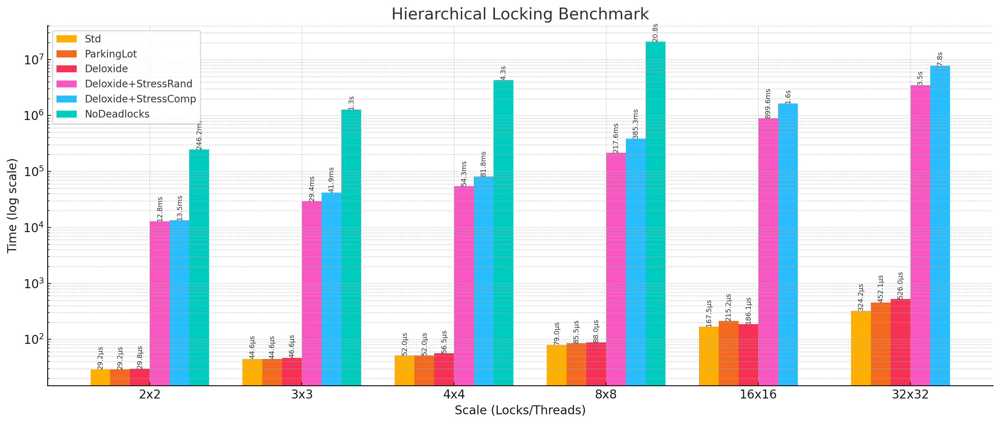
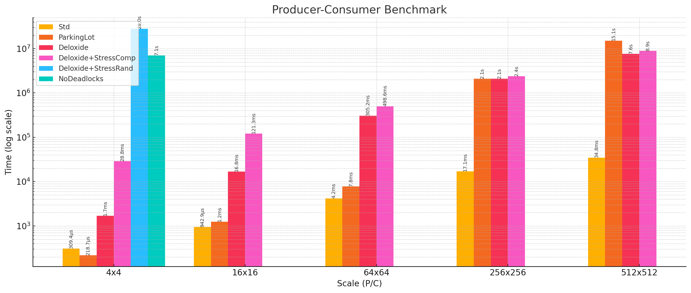

#  Deloxide - Cross-Language Deadlock Detector

[](https://www.rust-lang.org/)
[](LICENSE)

Deloxide is a cross-language deadlock detection library with visualization support. It tracks mutex and reader-writer lock operations in multi-threaded applications to detect, report, and visualize potential deadlocks in real-time.

## Features

- **Real-time deadlock detection** - Detects deadlocks as they happen
- **Cross-language support** - Core implementation in Rust with C bindings
- **Thread & lock tracking** - Monitors relationships between threads and sync primitives (Mutex, RwLock, Condvar)
- **Visualization** - Web-based visualization of thread-lock relationships (see [example](https://deloxide.vercel.app/?logs=H4sIAAAAAAAC_03NvQrCMBSG4ZNEHKqDiOIipYMWi1ROo_2hm4uDo3hlkVyAk-DgjejmZNE7cLVdPcWkOD688H3qCT0NrHVdF_77M57cmAbOjaYnkmgb-S-mOYDRLCKxgdUGSEOrLYk7VudaHasLSbhGAdataxWDFs1DsGNaNCvlkVqzUt5JwjOqnP-_qk-NjX5yVQEHxYVSnCvBHp5EGYeYhZHcyyhfJrnExSpNsySdI-aIX6996tkRAQAA
  ) here)
- **Low overhead** - Designed to be lightweight for use in production systems
- **Easy integration** - Simple API for both Rust and C
- **Stress testing** - Optional feature to increase deadlock manifestation during testing

> [!NOTE]
> Cross-platform support: Rust API works on Windows, macOS, and Linux. The C API is POSIX-first and ships with pthread-based convenience macros for macOS/Linux; on Windows those macros are disabled (see below) but the core C functions are fully usable.

## Project Architecture

### How Deloxide Works

1. **Initialization**: The application initializes Deloxide with optional logging and callback settings.

2. **Resource Creation**: When threads, mutexes, and reader-writer locks are created, they're registered with the deadlock detector.

3. **Lock Operations**: When a thread attempts to acquire a lock:
   - The attempt is recorded by the detector
   - If the lock is already held by another thread, a "wait-for" edge is added
   - The detector checks for cycles in the "wait-for" graph
   - If a cycle is found, a deadlock is reported

4. **Deadlock Detection**: When a deadlock is detected, the callback is invoked with detailed information, including which threads are involved and which locks they're waiting for.

5. **Visualization**: The `showcase` function can be called (automatically in the callback or manually) to visualize the thread-lock interactions in a web browser.

### Core Components

1. **Deadlock Detection Engine**
   - Maintains a "wait-for" graph of thread dependencies
   - Detects cycles in the graph to identify potential deadlocks
   - Reports detected deadlocks through a configurable callback

2. **Resource Tracking**
   - Tracks threads and locks as resources with lifecycles
   - Manages parent-child relationships between threads
   - Automatically cleans up resources when threads exit

3. **Logging and Visualization**
   - Records thread-lock interactions to a log file
   - Processes logs for visualization in a web browser
   - Provides automatic visualization when deadlocks are detected

4. **Cross-Language Support**
   - Rust API with `Mutex`, `RwLock`, and `Thread` types
   - C API through FFI bindings in `deloxide.h`
   - Simple macros for C to handle common operations

5. **Stress Testing** (Optional with stress-testing feature)
   - Strategically delays threads to increase deadlock probability
   - Multiple strategies for different testing scenarios
   - Available as an opt-in feature for testing environments

## Quick Start

### Rust

Deloxide provides drop-in replacements for standard synchronization primitives with deadlock detection capabilities. All primitives wrap parking_lot implementations and add unique identifiers for tracking and visualization.

#### Deloxide::Thread

A wrapper around `std::thread::JoinHandle` that automatically tracks thread lifecycle events:

```rust
pub struct Thread<T>(JoinHandle<T>);

impl<T> Thread<T> where T: Send + 'static {
    pub fn spawn<F>(f: F) -> Self where F: FnOnce() -> T + Send + 'static;
    pub fn join(self) -> thread::Result<T>;
}
```

Creating tracked threads is identical to standard threads:

```rust
use deloxide::Thread;

// Spawn a tracked thread - just like std::thread::spawn
let handle = Thread::spawn(|| {
    println!("Hello from tracked thread!");
    42
});

// Join works the same way
let result = handle.join().unwrap();
assert_eq!(result, 42);
```

It additionally generates a thread ID for deadlock detection, visualization and debugging purposes.

#### Deloxide::Mutex

A wrapper around `parking_lot::Mutex` that tracks lock operations:

```rust
pub struct Mutex<T> {
    id: LockId,
    inner: ParkingLotMutex<T>,
    creator_thread_id: ThreadId,
}

impl<T> Mutex<T> {
    pub fn new(data: T) -> Self;
    pub fn lock(&self) -> MutexGuard<'_, T>;
    pub fn try_lock(&self) -> Option<MutexGuard<'_, T>>;
    pub fn id(&self) -> LockId;
}
```

#### Deloxide::RwLock

A wrapper around `parking_lot::RwLock` supporting both read and write operations:

```rust
pub struct RwLock<T> {
    id: LockId,
    inner: ParkingLotRwLock<T>,
    creator_thread_id: ThreadId,
}

impl<T> RwLock<T> {
    pub fn new(data: T) -> Self;
    pub fn read(&self) -> RwLockReadGuard<'_, T>;
    pub fn write(&self) -> RwLockWriteGuard<'_, T>;
    pub fn try_read(&self) -> Option<RwLockReadGuard<'_, T>>;
    pub fn try_write(&self) -> Option<RwLockWriteGuard<'_, T>>;
    pub fn id(&self) -> LockId;
}
```

#### Deloxide::Condvar

A wrapper around `parking_lot::Condvar` for condition-based synchronization:

```rust
pub struct Condvar {
    id: CondvarId,
    inner: ParkingLotCondvar,
}

impl Condvar {
    pub fn new() -> Self;
    pub fn wait<T>(&self, guard: &mut MutexGuard<'_, T>);
    pub fn wait_timeout<T>(&self, guard: &mut MutexGuard<'_, T>, timeout: Duration) -> bool;
    pub fn notify_one(&self);
    pub fn notify_all(&self);
    pub fn id(&self) -> CondvarId;
}
```

#### Complete Usage Example

Here's a comprehensive example demonstrating all Deloxide primitives in a single scenario:

```rust
use deloxide::{Deloxide, Mutex, RwLock, Condvar, Thread};
use std::sync::Arc;
use std::time::Duration;
use std::thread;

fn main() {
    // Initialize the detector with logging and visualization
    Deloxide::new()
        .with_log("deadlock_{timestamp}.json")
        .callback(|info| {
            eprintln!("Deadlock detected! Threads: {:?}", info.thread_cycle);
            deloxide::showcase_this().expect("Failed to launch visualization");
        })
        .start()
        .expect("Failed to initialize detector");

    // Create synchronization primitives
    let counter = Arc::new(Mutex::new(0));
    let shared_data = Arc::new(RwLock::new(vec![1, 2, 3, 4, 5]));
    let condition_pair = Arc::new((Mutex::new(false), Condvar::new()));

    // Example 1: Mutex operations with potential deadlock
    let counter_clone1 = Arc::clone(&counter);
    let counter_clone2 = Arc::clone(&counter);
    let mutex_b = Arc::new(Mutex::new("Resource B"));
    let mutex_b_clone = Arc::clone(&mutex_b);

    // Thread 1: Lock counter, then mutex_b (deadlock scenario)
    Thread::spawn(move || {
        let _count = counter_clone1.lock();
        thread::sleep(Duration::from_millis(100));
        let _b = mutex_b.lock();
    });

    // Thread 2: Lock mutex_b, then counter (deadlock scenario) 
    Thread::spawn(move || {
        let _b = mutex_b_clone.lock();
        thread::sleep(Duration::from_millis(100));
        let _count = counter_clone2.lock();
    });

    // Example 2: RwLock with multiple readers and upgrade deadlock
    let shared_clone1 = Arc::clone(&shared_data);
    let shared_clone2 = Arc::clone(&shared_data);

    // Multiple reader threads
    for i in 0..3 {
        let shared_clone = Arc::clone(&shared_data);
        Thread::spawn(move || {
            let data = shared_clone.read();
            println!("Reader {}: {:?}", i, *data);
            thread::sleep(Duration::from_millis(50));
        });
    }

    // Writer thread attempting upgrade (potential deadlock)
    Thread::spawn(move || {
        let _read_guard = shared_clone1.read();
        println!("Writer acquired read lock, attempting upgrade...");
        thread::sleep(Duration::from_millis(25));
        let _write_guard = shared_clone2.write(); // This will deadlock!
        println!("Writer acquired write lock");
    });

    // Example 3: Condvar usage
    let pair_clone = Arc::clone(&condition_pair);
    
    // Waiter thread
    Thread::spawn(move || {
        let (mutex, condvar) = (&pair_clone.0, &pair_clone.1);
        let mut ready = mutex.lock();
        while !*ready {
            condvar.wait(&mut ready);
        }
        println!("Condition met, thread proceeding");
    });

    // Notifier thread
    let pair_clone2 = Arc::clone(&condition_pair);
    Thread::spawn(move || {
        thread::sleep(Duration::from_millis(200));
        let (mutex, condvar) = (&pair_clone2.0, &pair_clone2.1);
        let mut ready = mutex.lock();
        *ready = true;
        condvar.notify_one();
        println!("Condition signaled");
    });

    // Let threads run and potentially detect deadlocks
    thread::sleep(Duration::from_secs(2));
    println!("Program completed");
}
```

### C

The C API provides a complete interface to Deloxide through `include/deloxide.h`. It uses opaque pointers and helper macros to simplify integration with existing C codebases.

#### Core C API Functions

```c
// Initialization and cleanup
int deloxide_init(const char* log_file, void (*callback)(const char*));
void deloxide_cleanup(void);

// Mutex operations
void* deloxide_create_mutex(void);
void deloxide_destroy_mutex(void* mutex);
void deloxide_mutex_lock(void* mutex);
void deloxide_mutex_unlock(void* mutex);
int deloxide_mutex_try_lock(void* mutex);

// RwLock operations  
void* deloxide_create_rwlock(void);
void deloxide_destroy_rwlock(void* rwlock);
void deloxide_rwlock_read(void* rwlock);
void deloxide_rwlock_write(void* rwlock);
void deloxide_rwlock_unlock_read(void* rwlock);
void deloxide_rwlock_unlock_write(void* rwlock);

// Condvar operations
void* deloxide_create_condvar(void);
void deloxide_destroy_condvar(void* condvar);
void deloxide_condvar_wait(void* condvar, void* mutex);
void deloxide_condvar_notify_one(void* condvar);
void deloxide_condvar_notify_all(void* condvar);

// Thread tracking
void deloxide_thread_spawn(void);
void deloxide_thread_exit(void);
```

#### Helper Macros

Deloxide provides convenient macros for easier usage:

```c
// Thread tracking macros
DEFINE_TRACKED_THREAD(fn_name)     // Define a tracked thread wrapper
CREATE_TRACKED_THREAD(thread, fn, arg)  // Create and start tracked thread

// Mutex macros
LOCK_MUTEX(mutex)                  // Lock with automatic tracking
UNLOCK_MUTEX(mutex)                // Unlock with automatic tracking

// RwLock macros
RWLOCK_READ(rwlock)                // Acquire read lock
RWLOCK_WRITE(rwlock)               // Acquire write lock  
RWUNLOCK_READ(rwlock)              // Release read lock
RWUNLOCK_WRITE(rwlock)             // Release write lock

// Condvar macros
CONDVAR_WAIT(condvar, mutex)       // Wait on condition variable
CONDVAR_NOTIFY_ONE(condvar)        // Signal one waiting thread
CONDVAR_NOTIFY_ALL(condvar)        // Signal all waiting threads
```

#### Complete C Usage Example

Here's a comprehensive example demonstrating all C API features in one program:

```c
#include <stdio.h>
#include <stdlib.h>
#include <pthread.h>
#include <unistd.h>
#include "deloxide.h"

// Global synchronization primitives
void* counter_mutex;
void* shared_rwlock;
void* condition_mutex;
void* condition_var;
int shared_counter = 0;
int condition_ready = 0;

void deadlock_callback(const char* json_info) {
    printf("=== DEADLOCK DETECTED ===\n%s\n", json_info);
    deloxide_showcase_current();
}

// Example 1: Mutex deadlock scenario
void* mutex_worker1(void* arg) {
    void** mutexes = (void**)arg;
    void* mutex_a = mutexes[0];
    void* mutex_b = mutexes[1];
    
    printf("Thread 1: Locking mutex A\n");
    LOCK_MUTEX(mutex_a);
    usleep(100000);  // 100ms delay
    
    printf("Thread 1: Trying to lock mutex B\n");
    LOCK_MUTEX(mutex_b);  // Potential deadlock here
    
    printf("Thread 1: Got both locks, doing work\n");
    UNLOCK_MUTEX(mutex_b);
    UNLOCK_MUTEX(mutex_a);
    return NULL;
}

void* mutex_worker2(void* arg) {
    void** mutexes = (void**)arg;
    void* mutex_a = mutexes[0];
    void* mutex_b = mutexes[1];
    
    printf("Thread 2: Locking mutex B\n");
    LOCK_MUTEX(mutex_b);
    usleep(100000);  // 100ms delay
    
    printf("Thread 2: Trying to lock mutex A\n");
    LOCK_MUTEX(mutex_a);  // Potential deadlock here
    
    printf("Thread 2: Got both locks, doing work\n");
    UNLOCK_MUTEX(mutex_a);
    UNLOCK_MUTEX(mutex_b);
    return NULL;
}

// Example 2: RwLock usage
void* reader_worker(void* arg) {
    int reader_id = *(int*)arg;
    
    printf("Reader %d: Acquiring read lock\n", reader_id);
    RWLOCK_READ(shared_rwlock);
    
    printf("Reader %d: Reading shared data: %d\n", reader_id, shared_counter);
    usleep(50000);  // 50ms
    
    RWUNLOCK_READ(shared_rwlock);
    printf("Reader %d: Released read lock\n", reader_id);
    return NULL;
}

void* writer_worker(void* arg) {
    printf("Writer: Acquiring read lock first\n");
    RWLOCK_READ(shared_rwlock);
    
    printf("Writer: Attempting to upgrade to write lock\n");
    usleep(25000);  // 25ms
    RWLOCK_WRITE(shared_rwlock);  // This will deadlock!
    
    printf("Writer: Writing to shared data\n");
    shared_counter++;
    
    RWUNLOCK_WRITE(shared_rwlock);
    return NULL;
}

// Example 3: Condvar usage
void* condvar_waiter(void* arg) {
    printf("Waiter: Waiting for condition\n");
    LOCK_MUTEX(condition_mutex);
    
    while (!condition_ready) {
        CONDVAR_WAIT(condition_var, condition_mutex);
    }
    
    printf("Waiter: Condition met, proceeding\n");
    UNLOCK_MUTEX(condition_mutex);
    return NULL;
}

void* condvar_notifier(void* arg) {
    usleep(200000);  // 200ms delay
    
    printf("Notifier: Setting condition and signaling\n");
    LOCK_MUTEX(condition_mutex);
    condition_ready = 1;
    CONDVAR_NOTIFY_ONE(condition_var);
    UNLOCK_MUTEX(condition_mutex);
    return NULL;
}

// Define tracked thread wrappers
DEFINE_TRACKED_THREAD(mutex_worker1)
DEFINE_TRACKED_THREAD(mutex_worker2)
DEFINE_TRACKED_THREAD(reader_worker)
DEFINE_TRACKED_THREAD(writer_worker)
DEFINE_TRACKED_THREAD(condvar_waiter)
DEFINE_TRACKED_THREAD(condvar_notifier)

int main() {
    printf("Initializing Deloxide with deadlock detection\n");
    deloxide_init("c_deadlock_test.json", deadlock_callback);
    
    // Create synchronization primitives
    void* mutex_a = deloxide_create_mutex();
    void* mutex_b = deloxide_create_mutex();
    counter_mutex = deloxide_create_mutex();
    shared_rwlock = deloxide_create_rwlock();
    condition_mutex = deloxide_create_mutex();
    condition_var = deloxide_create_condvar();
    
    // Example 1: Mutex deadlock test
    printf("\n=== Testing Mutex Deadlock Scenario ===\n");
    void* mutex_args1[2] = {mutex_a, mutex_b};
    void* mutex_args2[2] = {mutex_a, mutex_b};
    
    pthread_t mutex_threads[2];
    CREATE_TRACKED_THREAD(mutex_threads[0], mutex_worker1, mutex_args1);
    CREATE_TRACKED_THREAD(mutex_threads[1], mutex_worker2, mutex_args2);
    
    // Example 2: RwLock upgrade deadlock test
    printf("\n=== Testing RwLock Upgrade Deadlock ===\n");
    pthread_t reader_threads[3];
    int reader_ids[3] = {1, 2, 3};
    
    for (int i = 0; i < 3; i++) {
        CREATE_TRACKED_THREAD(reader_threads[i], reader_worker, &reader_ids[i]);
    }
    
    pthread_t writer_thread;
    CREATE_TRACKED_THREAD(writer_thread, writer_worker, NULL);
    
    // Example 3: Condvar test (should work without deadlock)
    printf("\n=== Testing Condvar Synchronization ===\n");
    pthread_t condvar_threads[2];
    CREATE_TRACKED_THREAD(condvar_threads[0], condvar_waiter, NULL);
    CREATE_TRACKED_THREAD(condvar_threads[1], condvar_notifier, NULL);
    
    // Let all threads run and potentially detect deadlocks
    printf("\nWaiting for threads to complete or deadlock...\n");
    sleep(3);
    
    printf("Program completed - cleaning up\n");
    deloxide_cleanup();
    return 0;
}
```

#### C API Portability Notes

- **Linux/macOS**: Full pthread support, all features available
- **Windows**: Requires pthread-compatible library. Refer to [C API portability notes]

## Stress Testing

Deloxide includes an optional stress testing feature to increase the probability of deadlock manifestation during testing. This feature helps expose potential deadlocks by strategically delaying threads at critical points.

### Enabling Stress Testing

#### In Rust:

Enable the feature in your `Cargo.toml`:

```toml
[dependencies]
deloxide = { version = "0.2.1", features = ["stress-test"] }
```

Then use the stress testing API:

```rust
// With random preemption strategy
Deloxide::new()
    .with_log("deadlock.log")
    .with_random_stress()
    .callback(|info| {
        eprintln!("Deadlock detected! Cycle: {:?}", info.thread_cycle);
    })
    .start()
    .expect("Failed to initialize detector");

// Or with component-based strategy and custom configuration
use deloxide::StressConfig;

Deloxide::new()
    .with_log("deadlock.log")
    .with_component_stress()
    .with_stress_config(StressConfig {
        preemption_probability: 0.8,
        min_delay_ms: 5,
        max_delay_ms: 20,
        preempt_after_release: true,
    })
    .start()
    .expect("Failed to initialize detector");
```

#### In C:

Build Deloxide with the stress-test feature enabled, then:

```c
// Enable random preemption stress testing (70% probability, 1-10ms delays)
deloxide_enable_random_stress(0.7, 1, 10);

// Or enable component-based stress testing
deloxide_enable_component_stress(5, 15);

// Initialize detector
deloxide_init("deadlock.log", deadlock_callback);
```

### Stress Testing Modes

- **Random Preemption**: Randomly delays threads before lock acquisitions with configurable probability
- **Component-Based**: Analyzes lock acquisition patterns and intelligently targets delays to increase deadlock probability

> [!NOTE]
> Condvar wake-ups (notify_one/notify_all) trigger a synthesized mutex attempt for the woken thread to model the required mutex re-acquisition. Stress injection occurs on this synthetic mutex attempt (and on normal lock attempts), not directly on the condvar wait/notify operations.

## Building and Installation

### Rust

Deloxide is available on crates.io. You can add it as a dependency in your `Cargo.toml`:

```toml
[dependencies]
deloxide = "0.2.1"
```

With stress testing:

```toml
[dependencies]
deloxide = { version = "0.2.1", features = ["stress-test"] }
```

Or install the CLI tool to showcase deadlock logs directly:

```bash
cargo install deloxide
deloxide my_deadlock.log  # Opens visualization in browser
```

For development builds:

```bash
# Standard build
cargo build --release

# With stress testing feature
cargo build --release --features stress-test
```

### C

For C programs, you'll need to compile the Rust library and link against it:

```bash
# Build the Rust library
cargo build --release

# With stress testing feature
cargo build --release --features stress-test

# Compile your C program with Deloxide
gcc -Iinclude your_program.c -Ltarget/release -ldeloxide -lpthread -o your_program
```

A Makefile is included in the repository to simplify building and testing with C programs.
It handles building the Rust library and compiling the C test programs automatically.

### C API portability notes

- Thread ID size across FFI
  - The C header uses `uintptr_t` for all thread IDs; the Rust side uses `usize`. This ensures correct sizes on LP64 (Linux/macOS) and LLP64 (Windows).

- pthread-based helpers are POSIX-only
  - The convenience macros `DEFINE_TRACKED_THREAD` and `CREATE_TRACKED_THREAD` depend on `pthread.h` and are available only on non-Windows platforms.
  - On Windows, these macros are disabled at compile time. You can still use the full C API by manually registering thread lifecycle events.

- Manual thread registration (Windows or custom runtimes)
  1. Create your thread using your platform's API.
  2. In the thread entry, call `deloxide_register_thread_spawn(child_tid, parent_tid)` once. On the thread, get IDs from `deloxide_get_thread_id()`.
  3. Before the thread returns, call `deloxide_register_thread_exit(current_tid)`.

  Minimal example sketch (pseudo-C):

  ```c
  // In parent, capture parent thread id
  uintptr_t parent_tid = deloxide_get_thread_id();
  // Create thread with OS API (e.g., _beginthreadex / CreateThread)
  // In child thread entry:
  uintptr_t child_tid = deloxide_get_thread_id();
  deloxide_register_thread_spawn(child_tid, parent_tid);
  // ... user work ...
  deloxide_register_thread_exit(child_tid);
  ```

## Visualization

Deloxide includes a web-based visualization tool. After detecting a deadlock, use the showcase feature to view it in your browser:

```rust
// In Rust
deloxide::showcase("deadlock_log.log").expect("Failed to launch visualization");

// Or for the currently active log
deloxide::showcase_this().expect("Failed to launch visualization");
```

```c
// In C
deloxide_showcase("deadlock_log.log");

// Or for the currently active log
deloxide_showcase_current();
```

You can also automatically launch the visualization when a deadlock is detected by calling the showcase function in your deadlock callback.

Additionally, you can manually upload a log file to visualize deadlocks through the web interface:

[Deloxide Showcase](https://deloxide.vercel.app/)

## Documentation

For more detailed documentation:

- Crates.io: `https://crates.io/crates/deloxide`
- Rust Docs: `https://docs.rs/deloxide`
- C API: See `include/deloxide.h` and `https://docs.rs/deloxide/latest/deloxide/ffi/index.html`

## Performance & Evaluation

This part outlines the performance, deadlock detection capabilities, and robustness of `Deloxide`. We compare it against standard Rust mutexes (`std::sync::Mutex`), `parking_lot::Mutex` (with its `deadlock_detection` feature), and the `no_deadlocks` library.

**Key Takeaways (TL;DR):**
*   **Performance:** `Deloxide` introduces a manageable performance overhead in many common scenarios but can be more significant under heavy lock contention.
*   **Deadlock Detection:** `Deloxide`'s optional **stress testing** modes are exceptionally effective at uncovering hard-to-find "Heisenbug" deadlocks that are often missed by other detectors.
*   **Superior Speed:** `Deloxide` detects deadlocks up to **80x faster** than competing libraries, providing an immediate feedback loop for developers.
*   **Reliability:** `Deloxide` is robust and does **not** produce false alarms in deadlock-free code.

All benchmarks were run on a base M1 MacBook Pro with Rust 1.86.0-nightly.

> [!IMPORTANT]
> The following benchmarks were conducted using version v0.1.0 and currently cover only Mutex performance. Benchmarks for RwLock and Condvar will be added in future updates.

### 1. Performance Overhead

We evaluated overhead using both low-level microbenchmarks and application-level macrobenchmarks.

#### Microbenchmark Overhead

These tests measure the raw performance of creating a mutex and performing a single, uncontended lock/unlock cycle.

| Tested Setup | Mutex Generation Time (ns) | Lock/Unlock Time |
| :--- | :--- | :--- |
| **Std** | 17.4 ± 0.16 ns | **8.5 ± 0.07 ns** |
| **ParkingLot** | **16.4 ± 0.27 ns** | 9.7 ± 0.07 ns |
| **NoDeadlocks** | 31.6 ± 0.20 ns | 10.6 ± 0.11 µs |
| **Deloxide (Default)** | 36.2 ± 0.28 ns | 82.1 ± 0.38 ns |
| `Deloxide+StressRand` | 36.4 ± 0.23 ns | 3.2 ± 1.06 ms |
| `Deloxide+StressComp` | 36.3 ± 0.27 ns | 241.6 ± 4.08 ns |

*(Lower is better)*

`Deloxide`'s mutex creation and lock/unlock operations carry a higher base cost than `std` or `parking_lot` due to the integrated, real-time detection logic that runs on every operation.

#### Application-Level Overhead

We simulated two common application workloads to measure performance at scale.

**A) Hierarchical Locking Benchmark**

This benchmark involves multiple threads acquiring a sequence of locks, simulating scenarios with complex, multi-lock dependencies.



**Analysis:**
*   In this scenario, `Deloxide`'s baseline overhead is modest. At the 32x32 scale, it is **~1.62x slower** than `std::sync::Mutex` (526.0µs vs 324.2µs).
*   The stress testing modes (`Deloxide+StressRand`, `Deloxide+StressComp`) perform as expected, trading performance for improved bug detection, hence their significantly higher runtimes.
*   The `NoDeadlocks` library showed very high execution times and was not run at larger scales.

**B) Producer-Consumer Benchmark**

This benchmark models a high-contention scenario where multiple producer and consumer threads access a single shared queue protected by a mutex.



**Analysis:**
*   Under heavy contention for a single lock, `Deloxide`'s overhead is more pronounced. At the 4x4 scale, it is **~5.4x slower** than `std` (1.7ms vs 309.4µs).
*   The performance of `Deloxide+StressRand` (28.0s) and `NoDeadlocks` (7.1s) at the 4x4 scale made testing at larger scales impractical.
*   This benchmark highlights that `Deloxide`'s overhead is most noticeable in applications with a central, highly-contended bottleneck.

### 2. Deadlock Detection Capability

The primary goal of `Deloxide` is to find deadlocks. We tested its ability to detect "Heisenbugs"—elusive deadlocks that only occur under specific, rare thread interleavings. A superior detector not only finds these bugs but does so **quickly**, providing rapid feedback to the developer.

The table below shows the percentage of runs (out of 1000) where a deadlock was successfully detected, alongside the average time it took to find it.

| Tested Setup                  | Two-Lock Scenario  | Two-Lock Scenario  | Three-Lock-Cycle Scenario | Three-Lock-Cycle Scenario |
|:------------------------------|:------------------:|:------------------:|:-------------------------:|:-------------------------:|
|                               | **Detection Rate** | **Mean Time (ms)** |    **Detection Rate**     |    **Mean Time (ms)**     |
| **Deloxide (Default)**        |        5.9%        |        2.7         |           0.2%            |           45.9            |
| **`Deloxide+StressRand`**     |       51.2%        |        48.8        |           66.9%           |           158.5           |
| **`Deloxide+StressAggrRand`** |       57.0%        |        56.4        |           75.3%           |           124.4           |
| **`Deloxide+StressComp`**     |        4.6%        |        15.0        |        **100.0%**         |         **16.8**          |
| **ParkingLot**                |        3.7%        |        4.9         |           2.9%            |            5.8            |
| **NoDeadlocks**               |       100.0%       |     **1127.0**     |           98.9%           |        **1370.1**         |

*(Lower time is better)*

**Analysis:**
- Without stress testing, `Deloxide`'s detection rate for these rare deadlocks is low, similar to `parking_lot`. This is expected, as the deadlock condition rarely manifests naturally.
-  **Stress testing is the killer feature.** Enabling random preemption (`StressRand`) dramatically increases the detection rate to over 50-75%, while the component-based strategy (`StressComp`) achieved a **perfect 100% detection rate** for the complex three-lock cycle.
- **Superior Detection Speed:** The most critical finding is the **time to detection**.
   - `Deloxide+StressComp` found the three-lock deadlock in just **16.8 ms**.
   - In contrast, `NoDeadlocks` took **1,370 ms (1.4 seconds)** to detect the same bug.

### 3. False Positive Analysis

A deadlock detector must be reliable. We verified that `Deloxide` does not report deadlocks in correctly written, deadlock-free code.

We ran two deadlock-free scenarios 100 times each:
1.  **Gate Guarded:** Threads lock A then B, or B then A, but use a gate to prevent circular waits.
2.  **Four Hierarchical:** Locks are always acquired in a globally consistent order (A → B → C → D).

**Result:**
Across all tests, `Deloxide` (in all configurations), `parking_lot`, and `no_deadlocks` all passed with **zero false positives**.

See tests/examples in `/tests` or `/c_tests`

## License

```
/*
 *      ( (
 *       ) )
 *    ........
 *    |      |]  ☕
 *    \      /
 *     `----'
 *
 * "THE COFFEEWARE LICENSE" (Revision 1, Deloxide Edition):
 * (Inspired by the original Beerware License by Poul-Henning Kamp)
 *
 * Emirhan Tala and Ulaş Can Demirbağ wrote this file. As long as you retain
 * this notice, you can do whatever you want with this stuff — run it, fork it,
 * deploy it, tattoo it, or summon it in a thread ritual. We don't care.
 *
 * Just remember: we make no guarantees, provide no warranties, and accept no
 * responsibility for anything that happens. This software may or may not work,
 * may or may not cause your system to spontaneously combust into deadlocks,
 * and may or may not summon a sentient debugger from the void. But we accept
 * coffee! If we ever meet someday and you think this code helped you can buy 
 * us a coffee in return. Or not. No pressure. But coffee is nice. We love it!
 * ----------------------------------------------------------------------------
 */
```
