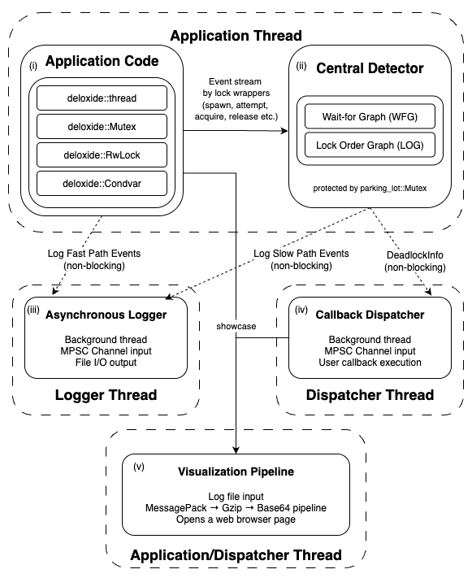
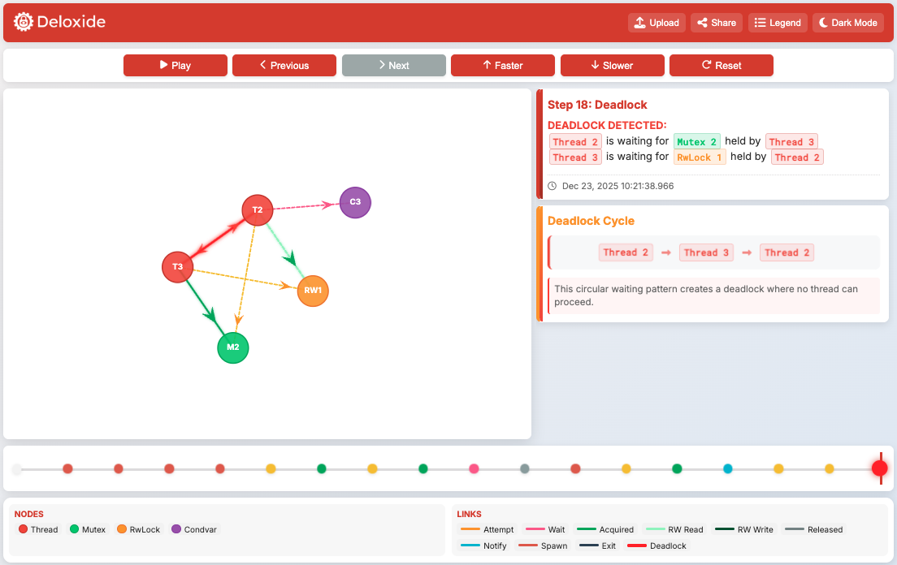
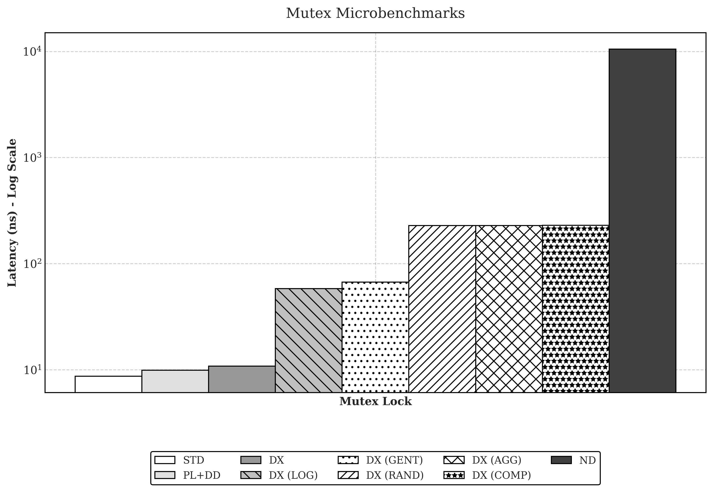
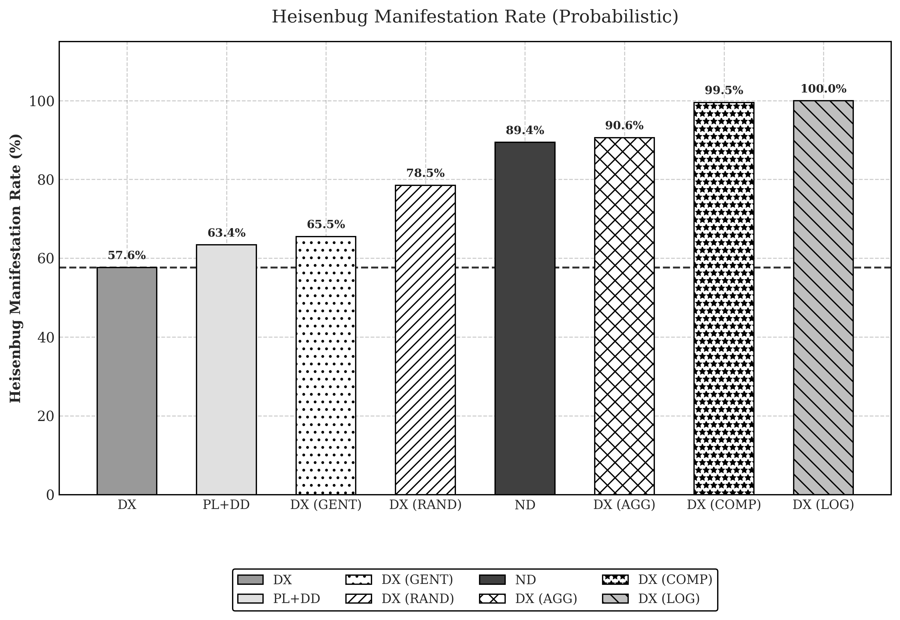

#  Deloxide - Cross-Language Deadlock Detector

[](https://www.rust-lang.org/)
[](LICENSE)

Deloxide is a cross-language deadlock detection library with visualization support. It tracks mutex and reader-writer lock operations in multi-threaded applications to detect, report, and visualize potential deadlocks in real-time.

## Features

- **Real-time deadlock detection** - Detects deadlocks as they happen using a Dual Detection Architecture (WFG + LOG)
- **Zero False Positives** - Wait-For Graph (WFG) analysis ensures 100% precision for active deadlocks
- **Optimistic Fast Path** - "Always-on" monitoring with negligible overhead (1.09x baseline / ~10.8ns)
- **Cross-language support** - Core implementation in Rust with C bindings
- **Stress Testing Framework** - Probabilistic scheduling with Component-Based Targeting (99.5% Heisenbug manifestation)
- **Visual Diagnostics** - Serverless, privacy-preserving visualization of thread interactions (see [example](https://deloxide.vercel.app/?logs=H4sIAAAAAAAC_03NvQrCMBSG4ZNEHKqDiOIipYMWi1ROo_2hm4uDo3hlkVyAk-DgjejmZNE7cLVdPcWkOD688H3qCT0NrHVdF_77M57cmAbOjaYnkmgb-S-mOYDRLCKxgdUGSEOrLYk7VundaHasLSbhGAdataxWDFs1DsGNaNCvlkVqzUt5JwjOqnP-_qk-Njq_5yVQEHxYVSnCvBHp5EGYeYhZHcyyhfJrnExSpNsySdI-aIX6996tkRAQAA
  ) here)
- **Easy integration** - Drop-in replacements for `parking_lot` primitives

> [!NOTE]
> Cross-platform support: Rust API works on Windows, macOS, and Linux. The C API is POSIX-first and ships with pthread-based convenience macros for macOS/Linux; on Windows those macros are disabled (see below) but the core C functions are fully usable.

## Project Architecture

### How Deloxide Works

1. **Initialization**: The application initializes Deloxide. Logging and lock order checking are enabled by default if their respective features are active.

2. **Resource Creation**: When threads, mutexes, and reader-writer locks are created, they're registered with the deadlock detector.

3. **Lock Operations**: When a thread attempts to acquire a lock:
   - **Optimistic Fast Path**: The system first attempts a fast-path acquisition using atomic operations. If successful (uncontended), it bypasses the detector entirely (zero overhead).
   - **Slow Path (Contended)**: If the lock is held, the attempt is recorded by the detector.
   - A "wait-for" edge is added to the graph.
   - The detector checks for cycles in the "wait-for" graph.
   - If a cycle is found, a deadlock is reported.

4. **Deadlock Detection**: When a deadlock is detected, the callback is invoked with detailed information, including which threads are involved and which locks they're waiting for.

5. **Visualization**: The `showcase` function can be called (automatically in the callback or manually) to visualize the thread-lock interactions in a web browser.

### Core Components

1. **Dual Detection Engine**
   - **Wait-For Graph (WFG)**: The default, reactive tier. Detects active circular dependencies with mathematical certainty (0 false positives).
   - **Lock Order Graph (LOG)**: An optional, proactive tier. Analyzes historical acquisition patterns to warn about potential deadlocks before they occur (requires `lock-order-graph` feature).



2. **Optimistic Fast Path**
   - Implements an "Optimistic Fast Path" architecture using atomic release-acquire semantics.
   - Bypasses the global detector entirely for uncontended locks.
   - Lowers instrumentation overhead to just **~10.8ns** (1.09x of standard `parking_lot`), enabling "always-on" production monitoring.

3. **Stress Testing Framework** (Optional)
   - Employs **Probabilistic Concurrency Testing (PCT)** to expose Heisenbugs.
   - **Component-Based Targeting**: Intelligently injects delays into interacting lock groups.
   - Achieves a **99.5% manifestation rate** for latent deadlocks (vs 63.4% for passive tools).

4. **Resource Tracking**
   - Tracks threads and locks as resources with lifecycles
   - Manages parent-child relationships between threads
   - Automatically cleans up resources when threads exit

5. **Visualization Pipeline**
   - **Serverless Sharing**: Compresses logs into URL-safe Base64 payloads (MessagePack + Gzip).
   - **Privacy-First**: All decoding and rendering happens client-side; no data is sent to external servers.
   - Provides interactive timelines and dependency graphs.
   
   

6. **Cross-Language Support**
   - Rust API with `Mutex`, `RwLock`, `Condvar`, and `thread` module
   - C API through FFI bindings in `deloxide.h`
   - Simple macros for C to handle common operations


## Quick Start

### Rust

Deloxide provides drop-in replacements for standard synchronization primitives with deadlock detection capabilities. All primitives wrap parking_lot implementations and add unique identifiers for tracking and visualization.

#### deloxide::thread

A drop-in replacement for `std::thread` that automatically tracks thread lifecycle events. All `std::thread` functions and types are available with added deadlock detection:

```rust
// All std::thread items are re-exported
pub use std::thread::{
    AccessError, JoinHandle, LocalKey, Result, Scope, 
    ScopedJoinHandle, Thread, ThreadId, available_parallelism, 
    current, panicking, park, park_timeout, sleep, yield_now,
};

// Custom spawn function with tracking
pub fn spawn<F, T>(f: F) -> JoinHandle<T> 
    where F: FnOnce() -> T + Send + 'static, T: Send + 'static;

// Custom Builder with tracking
pub struct Builder { /* ... */ }
```

Using tracked threads is identical to using `std::thread`:

```rust
use deloxide::thread;

// Spawn a tracked thread - exactly like std::thread::spawn
let handle = thread::spawn(|| {
    println!("Hello from tracked thread!");
    42
});

// All std::thread functions work
thread::yield_now();
thread::sleep(Duration::from_millis(100));
let current = thread::current();

// Builder pattern supported
let handle = thread::Builder::new()
    .name("worker".to_string())
    .stack_size(32 * 1024)
    .spawn(|| { /* ... */ })
    .unwrap();

// Join works the same way
let result = handle.join().unwrap();
assert_eq!(result, 42);
```

It automatically registers thread spawn/exit events for deadlock detection, visualization, and debugging purposes.

#### Deloxide::Mutex

A drop-in replacement for `std::sync::Mutex` (based on `parking_lot::Mutex`) with tracking:

```rust
pub struct Mutex<T> {
    id: LockId,
    inner: ParkingLotMutex<T>,
    creator_thread_id: ThreadId,
}

impl<T> Mutex<T> {
    pub fn new(data: T) -> Self;
    pub fn lock(&self) -> MutexGuard<'_, T>;
    pub fn try_lock(&self) -> Option<MutexGuard<'_, T>>;
    pub fn into_inner(self) -> T where T: Sized;
    pub fn get_mut(&mut self) -> &mut T;
    pub fn id(&self) -> LockId;
}

impl<T: Default> Default for Mutex<T> { /* ... */ }
impl<T> From<T> for Mutex<T> { /* ... */ }
```

All `std::sync::Mutex` methods are supported (except poisoning-related ones, as parking_lot doesn't use poisoning).

#### Deloxide::RwLock

A drop-in replacement for `std::sync::RwLock` (based on `parking_lot::RwLock`) with tracking:

```rust
pub struct RwLock<T> {
    id: LockId,
    inner: ParkingLotRwLock<T>,
    creator_thread_id: ThreadId,
}

impl<T> RwLock<T> {
    pub fn new(data: T) -> Self;
    pub fn read(&self) -> RwLockReadGuard<'_, T>;
    pub fn write(&self) -> RwLockWriteGuard<'_, T>;
    pub fn try_read(&self) -> Option<RwLockReadGuard<'_, T>>;
    pub fn try_write(&self) -> Option<RwLockWriteGuard<'_, T>>;
    pub fn into_inner(self) -> T where T: Sized;
    pub fn get_mut(&mut self) -> &mut T;
    pub fn id(&self) -> LockId;
}

impl<T: Default> Default for RwLock<T> { /* ... */ }
impl<T> From<T> for RwLock<T> { /* ... */ }
```

All `std::sync::RwLock` methods are supported (except poisoning-related ones).

#### Deloxide::Condvar

A drop-in replacement for `std::sync::Condvar` (based on `parking_lot::Condvar`) with tracking:

```rust
pub struct Condvar {
    id: CondvarId,
    inner: ParkingLotCondvar,
}

impl Condvar {
    pub fn new() -> Self;
    pub fn wait<T>(&self, guard: &mut MutexGuard<'_, T>);
    pub fn wait_while<T, F>(&self, guard: &mut MutexGuard<'_, T>, condition: F)
        where F: FnMut(&mut T) -> bool;
    pub fn wait_timeout<T>(&self, guard: &mut MutexGuard<'_, T>, timeout: Duration) -> bool;
    pub fn wait_timeout_while<T, F>(&self, guard: &mut MutexGuard<'_, T>, 
        timeout: Duration, condition: F) -> bool
        where F: FnMut(&mut T) -> bool;
    pub fn notify_one(&self);
    pub fn notify_all(&self);
    pub fn id(&self) -> CondvarId;
}

impl Default for Condvar { /* ... */ }
```

All `std::sync::Condvar` methods are supported.

#### Complete Usage Example

Here's a comprehensive example demonstrating all Deloxide primitives in a single scenario:

```rust
use deloxide::{Deloxide, Mutex, RwLock, Condvar, thread};
use std::sync::Arc;
use std::time::Duration;

fn main() {
    // Initialize the detector with logging and visualization
    // (requires the `visualization` feature)
    // (Logging is enabled by default to "deloxide.log" if the feature is active)
    Deloxide::new()
        .callback(|info| {
            eprintln!("Deadlock detected! Threads: {:?}", info.thread_cycle);
            deloxide::showcase_this().expect("Failed to launch visualization");
        })
        .start()
        .expect("Failed to initialize detector");

    // Create synchronization primitives
    let counter = Arc::new(Mutex::new(0));
    let shared_data = Arc::new(RwLock::new(vec![1, 2, 3, 4, 5]));
    let condition_pair = Arc::new((Mutex::new(false), Condvar::new()));

    // Example 1: Mutex operations with potential deadlock
    let counter_clone1 = Arc::clone(&counter);
    let counter_clone2 = Arc::clone(&counter);
    let mutex_b = Arc::new(Mutex::new("Resource B"));
    let mutex_b_clone = Arc::clone(&mutex_b);

    // Thread 1: Lock counter, then mutex_b (deadlock scenario)
    thread::spawn(move || {
        let _count = counter_clone1.lock();
        thread::sleep(Duration::from_millis(100));
        let _b = mutex_b.lock();
    });

    // Thread 2: Lock mutex_b, then counter (deadlock scenario) 
    thread::spawn(move || {
        let _b = mutex_b_clone.lock();
        thread::sleep(Duration::from_millis(100));
        let _count = counter_clone2.lock();
    });

    // Example 2: RwLock with multiple readers and upgrade deadlock
    let shared_clone1 = Arc::clone(&shared_data);
    let shared_clone2 = Arc::clone(&shared_data);

    // Multiple reader threads
    for i in 0..3 {
        let shared_clone = Arc::clone(&shared_data);
        thread::spawn(move || {
            let data = shared_clone.read();
            println!("Reader {}: {:?}", i, *data);
            thread::sleep(Duration::from_millis(50));
        });
    }

    // Writer thread attempting upgrade (potential deadlock)
    thread::spawn(move || {
        let _read_guard = shared_clone1.read();
        println!("Writer acquired read lock, attempting upgrade...");
        thread::sleep(Duration::from_millis(25));
        let _write_guard = shared_clone2.write(); // This will deadlock!
        println!("Writer acquired write lock");
    });

    // Example 3: Condvar usage with wait_while
    let pair_clone = Arc::clone(&condition_pair);
    
    // Waiter thread using convenient wait_while method
    thread::spawn(move || {
        let (mutex, condvar) = (&pair_clone.0, &pair_clone.1);
        let mut ready = mutex.lock();
        // wait_while is more convenient than a manual loop!
        condvar.wait_while(&mut ready, |ready| !*ready);
        println!("Condition met, thread proceeding");
    });

    // Notifier thread
    let pair_clone2 = Arc::clone(&condition_pair);
    thread::spawn(move || {
        thread::sleep(Duration::from_millis(200));
        let (mutex, condvar) = (&pair_clone2.0, &pair_clone2.1);
        let mut ready = mutex.lock();
        *ready = true;
        condvar.notify_one();
        println!("Condition signaled");
    });

    // Let threads run and potentially detect deadlocks
    thread::sleep(Duration::from_secs(2));
    println!("Program completed");
}
```

### C

The C API provides a complete interface to Deloxide through `include/deloxide.h`. It uses opaque pointers and helper macros to simplify integration with existing C codebases.

#### Core C API Functions

```c
// Initialization
int deloxide_init(const char* log_path, void (*callback)(const char* json_info));
int deloxide_is_deadlock_detected();
void deloxide_reset_deadlock_flag();
int deloxide_is_logging_enabled();

// Mutex operations
void* deloxide_create_mutex(void);
void* deloxide_create_mutex_with_creator(uintptr_t creator_thread_id);
void deloxide_destroy_mutex(void* mutex);
int deloxide_lock_mutex(void* mutex);
int deloxide_unlock_mutex(void* mutex);
uintptr_t deloxide_get_mutex_creator(void* mutex);

// RwLock operations  
void* deloxide_create_rwlock(void);
void* deloxide_create_rwlock_with_creator(uintptr_t creator_thread_id);
void deloxide_destroy_rwlock(void* rwlock);
int deloxide_rw_lock_read(void* rwlock);
int deloxide_rw_unlock_read(void* rwlock);
int deloxide_rw_lock_write(void* rwlock);
int deloxide_rw_unlock_write(void* rwlock);
uintptr_t deloxide_get_rwlock_creator(void* rwlock);

// Condvar operations
void* deloxide_create_condvar(void);
void* deloxide_create_condvar_with_creator(uintptr_t creator_thread_id);
void deloxide_destroy_condvar(void* condvar);
int deloxide_condvar_wait(void* condvar, void* mutex);
int deloxide_condvar_wait_timeout(void* condvar, void* mutex, unsigned long timeout_ms);
int deloxide_condvar_notify_one(void* condvar);
int deloxide_condvar_notify_all(void* condvar);

// Thread tracking
int deloxide_register_thread_spawn(uintptr_t thread_id, uintptr_t parent_id);
int deloxide_register_thread_exit(uintptr_t thread_id);
uintptr_t deloxide_get_thread_id();

// Logging and visualization
int deloxide_flush_logs();
int deloxide_showcase(const char* log_path);
int deloxide_showcase_current();
```

#### Helper Macros

Deloxide provides convenient macros for easier usage:

```c
// Thread tracking macros
DEFINE_TRACKED_THREAD(fn_name)     // Define a tracked thread wrapper
CREATE_TRACKED_THREAD(thread, fn, arg)  // Create and start tracked thread

// Mutex macros
LOCK_MUTEX(mutex)                  // Lock with automatic tracking
UNLOCK_MUTEX(mutex)                // Unlock with automatic tracking

// RwLock macros
RWLOCK_READ(rwlock)                // Acquire read lock
RWLOCK_WRITE(rwlock)               // Acquire write lock  
RWUNLOCK_READ(rwlock)              // Release read lock
RWUNLOCK_WRITE(rwlock)             // Release write lock

// Condvar macros
CONDVAR_WAIT(condvar, mutex)       // Wait on condition variable
CONDVAR_NOTIFY_ONE(condvar)        // Signal one waiting thread
CONDVAR_NOTIFY_ALL(condvar)        // Signal all waiting threads
```

#### Complete C Usage Example

Here's a comprehensive example demonstrating all C API features in one program:

```c
#include <stdio.h>
#include <stdlib.h>
#include <pthread.h>
#include <unistd.h>
#include "deloxide.h"

// Global synchronization primitives
void* counter_mutex;
void* shared_rwlock;
void* condition_mutex;
void* condition_var;
int shared_counter = 0;
int condition_ready = 0;

void deadlock_callback(const char* json_info) {
    printf("=== DEADLOCK DETECTED ===\n%s\n", json_info);
    deloxide_showcase_current();
}

// Example 1: Mutex deadlock scenario
void* mutex_worker1(void* arg) {
    void** mutexes = (void**)arg;
    void* mutex_a = mutexes[0];
    void* mutex_b = mutexes[1];
    
    printf("Thread 1: Locking mutex A\n");
    LOCK_MUTEX(mutex_a);
    usleep(100000);  // 100ms delay
    
    printf("Thread 1: Trying to lock mutex B\n");
    LOCK_MUTEX(mutex_b);  // Potential deadlock here
    
    printf("Thread 1: Got both locks, doing work\n");
    UNLOCK_MUTEX(mutex_b);
    UNLOCK_MUTEX(mutex_a);
    return NULL;
}

void* mutex_worker2(void* arg) {
    void** mutexes = (void**)arg;
    void* mutex_a = mutexes[0];
    void* mutex_b = mutexes[1];
    
    printf("Thread 2: Locking mutex B\n");
    LOCK_MUTEX(mutex_b);
    usleep(100000);  // 100ms delay
    
    printf("Thread 2: Trying to lock mutex A\n");
    LOCK_MUTEX(mutex_a);  // Potential deadlock here
    
    printf("Thread 2: Got both locks, doing work\n");
    UNLOCK_MUTEX(mutex_a);
    UNLOCK_MUTEX(mutex_b);
    return NULL;
}

// Example 2: RwLock usage
void* reader_worker(void* arg) {
    int reader_id = *(int*)arg;
    
    printf("Reader %d: Acquiring read lock\n", reader_id);
    RWLOCK_READ(shared_rwlock);
    
    printf("Reader %d: Reading shared data: %d\n", reader_id, shared_counter);
    usleep(50000);  // 50ms
    
    RWUNLOCK_READ(shared_rwlock);
    printf("Reader %d: Released read lock\n", reader_id);
    return NULL;
}

void* writer_worker(void* arg) {
    printf("Writer: Acquiring read lock first\n");
    RWLOCK_READ(shared_rwlock);
    
    printf("Writer: Attempting to upgrade to write lock\n");
    usleep(25000);  // 25ms
    RWLOCK_WRITE(shared_rwlock);  // This will deadlock!
    
    printf("Writer: Writing to shared data\n");
    shared_counter++;
    
    RWUNLOCK_WRITE(shared_rwlock);
    return NULL;
}

// Example 3: Condvar usage
void* condvar_waiter(void* arg) {
    printf("Waiter: Waiting for condition\n");
    LOCK_MUTEX(condition_mutex);
    
    while (!condition_ready) {
        CONDVAR_WAIT(condition_var, condition_mutex);
    }
    
    printf("Waiter: Condition met, proceeding\n");
    UNLOCK_MUTEX(condition_mutex);
    return NULL;
}

void* condvar_notifier(void* arg) {
    usleep(200000);  // 200ms delay
    
    printf("Notifier: Setting condition and signaling\n");
    LOCK_MUTEX(condition_mutex);
    condition_ready = 1;
    CONDVAR_NOTIFY_ONE(condition_var);
    UNLOCK_MUTEX(condition_mutex);
    return NULL;
}

// Define tracked thread wrappers
DEFINE_TRACKED_THREAD(mutex_worker1)
DEFINE_TRACKED_THREAD(mutex_worker2)
DEFINE_TRACKED_THREAD(reader_worker)
DEFINE_TRACKED_THREAD(writer_worker)
DEFINE_TRACKED_THREAD(condvar_waiter)
DEFINE_TRACKED_THREAD(condvar_notifier)

int main() {
    printf("Initializing Deloxide with deadlock detection\n");
    deloxide_init("c_deadlock_test.json", deadlock_callback);
    
    // Create synchronization primitives
    void* mutex_a = deloxide_create_mutex();
    void* mutex_b = deloxide_create_mutex();
    counter_mutex = deloxide_create_mutex();
    shared_rwlock = deloxide_create_rwlock();
    condition_mutex = deloxide_create_mutex();
    condition_var = deloxide_create_condvar();
    
    // Example 1: Mutex deadlock test
    printf("\n=== Testing Mutex Deadlock Scenario ===\n");
    void* mutex_args1[2] = {mutex_a, mutex_b};
    void* mutex_args2[2] = {mutex_a, mutex_b};
    
    pthread_t mutex_threads[2];
    CREATE_TRACKED_THREAD(mutex_threads[0], mutex_worker1, mutex_args1);
    CREATE_TRACKED_THREAD(mutex_threads[1], mutex_worker2, mutex_args2);
    
    // Example 2: RwLock upgrade deadlock test
    printf("\n=== Testing RwLock Upgrade Deadlock ===\n");
    pthread_t reader_threads[3];
    int reader_ids[3] = {1, 2, 3};
    
    for (int i = 0; i < 3; i++) {
        CREATE_TRACKED_THREAD(reader_threads[i], reader_worker, &reader_ids[i]);
    }
    
    pthread_t writer_thread;
    CREATE_TRACKED_THREAD(writer_thread, writer_worker, NULL);
    
    // Example 3: Condvar test (should work without deadlock)
    printf("\n=== Testing Condvar Synchronization ===\n");
    pthread_t condvar_threads[2];
    CREATE_TRACKED_THREAD(condvar_threads[0], condvar_waiter, NULL);
    CREATE_TRACKED_THREAD(condvar_threads[1], condvar_notifier, NULL);
    
    // Let all threads run and potentially detect deadlocks
    printf("\nWaiting for threads to complete or deadlock...\n");
    sleep(3);
    
    printf("Program completed\n");
    return 0;
}
```

#### C API Portability Notes

- **Linux/macOS**: Full pthread support, all features available
- **Windows**: Requires pthread-compatible library. Refer to [C API portability notes]

## Lock Order Graph

Deloxide includes an optional lock order graph feature that detects potential deadlocks by tracking lock acquisition ordering patterns, even when threads don't actually block. This provides early warning of dangerous lock ordering patterns that could lead to deadlocks.

### Enabling Lock Order Graph

#### In Rust:

Enable the feature in your `Cargo.toml`:

```toml
[dependencies]
deloxide = { version = "0.4", features = ["lock-order-graph"] }
```

Then use the lock order checking API:

```rust
use deloxide::{Deloxide, DeadlockSource};

Deloxide::new()
    .with_log("deadlock.log")
    // Lock order checking is enabled by default if the feature is on,
    // but you can explicitly enable it (no-op) or disable it with .no_lock_order_checking()
    .callback(|info| {
        match info.source {
            DeadlockSource::WaitForGraph => {
                eprintln!("🚨 ACTUAL DEADLOCK! Threads are blocked.");
            }
            DeadlockSource::LockOrderViolation => {
                eprintln!("⚠️  SUSPECTED DEADLOCK! Dangerous lock ordering pattern.");
                if let Some(cycle) = &info.lock_order_cycle {
                    eprintln!("Lock order cycle: {:?}", cycle);
                }
            }
        }
    })
    .start()
    .expect("Failed to initialize detector");
```

### How Lock Order Graph Works

When a thread holds lock A and then acquires lock B, the system records that A < B (A must be acquired before B). If later the system sees an attempt to acquire A while holding B (B < A), this creates a cycle in the lock order graph and indicates a potential deadlock.

**Note:** Lock order graph detection may report patterns that never actually deadlock (false positives). It's recommended for development and testing, not production.

## Stress Testing

Deloxide includes an optional stress testing feature to increase the probability of deadlock manifestation during testing. This feature helps expose potential deadlocks by strategically delaying threads at critical points.

> [!NOTE]
> All stress delays are now specified in microseconds (`*_us`). If you previously configured `min_delay_ms` / `max_delay_ms`, update your code and FFI calls accordingly.

### Enabling Stress Testing

#### In Rust:

Enable the feature in your `Cargo.toml`:

```toml
[dependencies]
deloxide = { version = "0.4", features = ["stress-test"] }
```

Then use the stress testing API:

```rust
// With random preemption strategy
Deloxide::new()
    .with_log("deadlock.log")
    .with_random_stress()
    .callback(|info| {
        eprintln!("Deadlock detected! Cycle: {:?}", info.thread_cycle);
    })
    .start()
    .expect("Failed to initialize detector");

// Or with component-based strategy and custom configuration
use deloxide::StressConfig;

Deloxide::new()
    .with_log("deadlock.log")
    .with_component_stress()
    .with_stress_config(StressConfig {
        preemption_probability: 0.8,
        min_delay_us: 500,
        max_delay_us: 2000,
        preempt_after_release: true,
    })
    .start()
    .expect("Failed to initialize detector");

// Or use one of the presets
Deloxide::new()
    .with_log("deadlock.log")
    .with_component_stress()
    .with_stress_config(StressConfig::aggressive())
    .start()
    .expect("Failed to initialize detector");
```

#### In C:

Build Deloxide with the stress-test feature enabled, then:

```c
// Enable random preemption stress testing (70% probability, 100-1000us delays)
deloxide_enable_random_stress(0.7, 100, 1000);

// Or enable component-based stress testing
deloxide_enable_component_stress(5000, 15000);

// Initialize detector
deloxide_init("deadlock.log", deadlock_callback);
```

### Stress Testing Modes

- **Random Preemption**: Randomly delays threads before lock acquisitions with configurable probability
- **Component-Based**: Analyzes lock acquisition patterns and intelligently targets delays to increase deadlock probability

> [!NOTE]
> Condvar wake-ups (notify_one/notify_all) trigger a synthesized mutex attempt for the woken thread to model the required mutex re-acquisition. Stress injection occurs on this synthetic mutex attempt (and on normal lock attempts), not directly on the condvar wait/notify operations.

## Building and Installation

### Rust

Deloxide is available on crates.io. You can add it as a dependency in your `Cargo.toml`:

```toml
[dependencies]
deloxide = "0.4"
```

With lock order graph:

```toml
[dependencies]
deloxide = { version = "0.4", features = ["lock-order-graph"] }
```

With stress testing:

```toml
[dependencies]
deloxide = { version = "0.4", features = ["stress-test"] }
```

With both features:

```toml
[dependencies]
deloxide = { version = "0.4", features = ["lock-order-graph", "stress-test"] }
```

Or install the CLI tool to showcase deadlock logs directly:

```bash
cargo install deloxide
deloxide my_deadlock.log  # Opens visualization in browser
```

For development builds:

```bash
# Standard build
cargo build --release

# With lock order graph feature
cargo build --release --features lock-order-graph

# With stress testing feature
cargo build --release --features stress-test

# With both features
cargo build --release --features lock-order-graph,stress-test
```

### C

For C programs, you'll need to compile the Rust library and link against it:

```bash
# Build the Rust library
cargo build --release

# With lock order graph feature
cargo build --release --features lock-order-graph

# With stress testing feature
cargo build --release --features stress-test

# With both features
cargo build --release --features lock-order-graph,stress-test

# Compile your C program with Deloxide
gcc -Iinclude your_program.c -Ltarget/release -ldeloxide -lpthread -o your_program
```

A Makefile is included in the repository to simplify building and testing with C programs.
It handles building the Rust library and compiling the C test programs automatically.

### C API portability notes

- Thread ID size across FFI
  - The C header uses `uintptr_t` for all thread IDs; the Rust side uses `usize`. This ensures correct sizes on LP64 (Linux/macOS) and LLP64 (Windows).

- pthread-based helpers are POSIX-only
  - The convenience macros `DEFINE_TRACKED_THREAD` and `CREATE_TRACKED_THREAD` depend on `pthread.h` and are available only on non-Windows platforms.
  - On Windows, these macros are disabled at compile time. You can still use the full C API by manually registering thread lifecycle events.

- Manual thread registration (Windows or custom runtimes)
  1. Create your thread using your platform's API.
  2. In the thread entry, call `deloxide_register_thread_spawn(child_tid, parent_tid)` once. On the thread, get IDs from `deloxide_get_thread_id()`.
  3. Before the thread returns, call `deloxide_register_thread_exit(current_tid)`.

  Minimal example sketch (pseudo-C):

  ```c
  // In parent, capture parent thread id
  uintptr_t parent_tid = deloxide_get_thread_id();
  // Create thread with OS API (e.g., _beginthreadex / CreateThread)
  // In child thread entry:
  uintptr_t child_tid = deloxide_get_thread_id();
  deloxide_register_thread_spawn(child_tid, parent_tid);
  // ... user work ...
  deloxide_register_thread_exit(child_tid);
  ```

## Visualization

Deloxide includes a web-based visualization tool. After detecting a deadlock, use the showcase feature to view it in your browser:

```rust
// In Rust
deloxide::showcase("deadlock_log.log").expect("Failed to launch visualization");

// Or for the currently active log
deloxide::showcase_this().expect("Failed to launch visualization");
```

```c
// In C
deloxide_showcase("deadlock_log.log");

// Or for the currently active log
deloxide_showcase_current();
```

You can also automatically launch the visualization when a deadlock is detected by calling the showcase function in your deadlock callback.

Additionally, you can manually upload a log file to visualize deadlocks through the web interface:

[Deloxide Showcase](https://deloxide.vercel.app/)

## Documentation

For more detailed documentation:

- Crates.io: `https://crates.io/crates/deloxide`
- Rust Docs: `https://docs.rs/deloxide`
- C API: See `include/deloxide.h` and `https://docs.rs/deloxide/latest/deloxide/ffi/index.html`


## Performance & Validation

Deloxide has been evaluated through a three-tiered testing framework: **Correctness** (Guaranteed Deadlocks), **Stress Testing** (Heisenbugs), and **Performance** (Micro/Macrobenchmarks).

### 1. Methodology
- **Guaranteed Deadlock Tests**: Validates that the WFG logic detects 100% of deterministic cycles (e.g., barriers enforcing circular wait).
- **Heisenbug Manifestation**: Uses probabilistic scheduling to force race conditions in non-deterministic scenarios (e.g., Dining Philosophers without barriers).
- **False Positive Analysis**: Tested against 56 complex "false positive" scenarios (e.g., Gate Guarded, Lock Order Inversion) to ensure 0% false alarm rate.

### 2. Microbenchmark Overhead
The "Optimistic Fast Path" ensures minimal impact on atomic operations. Deloxide incurs only ~1ns overhead per lock operation.



| Metric | STD | PL+DD | **DX** | DX (LOG) | DX (COMP) | ND |
| :--- | :--- | :--- | :--- | :--- | :--- | :--- |
| **Mutex Lock** | 8.7ns | 9.9ns | **10.8ns** | 58.1ns | 229.4ns | 10,527ns |
| **RwLock Write** | 10.1ns | 12.8ns | **13.9ns** | 57.7ns | 234.1ns | 10,797ns |
| **RwLock Read** | 13.9ns | 16.1ns | **62.4ns** | 85.5ns | 222.5ns | 10,895ns |
| **Condvar** | 17.1µs | 17.2µs | **19.6µs** | 17.4µs | 20.3µs | 2,100µs |

> *PL+DD = parking_lot + detection, ND = no_deadlocks. DX (COMP) intentional overhead forces thread interleaving.*

### 3. Real-World Validation: Ray Tracing
In a high-contention Ray Tracing case study (1080p, ~4kHz locking), Deloxide demonstrated superior **deterministic stability**.

| Config | 426x240 | 854x480 | 1280x720 | 1920x1080 (Saturation) |
| :--- | :--- | :--- | :--- | :--- |
| **STD** | 0.81s ± 0.03 | 3.41s ± 0.15 | 7.33s ± 0.31 | 17.22s ± 0.65 |
| **PL+DD** | 0.81s ± 0.00 | 3.26s ± 0.02 | 7.19s ± 0.03 | 18.32s ± 0.06 |
| **DX (Default)** | **0.80s ± 0.00** | **3.18s ± 0.01** | **7.09s ± 0.03** | **16.67s ± 0.09** |
| **ND** | 33.0s ± 31.4 | 220.9s ± 182 | 192.9s ± 281 | 329.1s ± 554 |

**Key Result**: At 1080p, Deloxide (16.67s) is **9% faster** than the baseline parking_lot (18.32s) and significantly more stable (CV < 0.6%) than STD.

### 4. Heisenbug Manifestation Rates (Stress Testing)
Comparison of manifestation rates (1000 iterations) across different strategies. **Active stress testing is required to find latent bugs.**



| Scenario | DX (Passive) | DX (RAND) | DX (AGG) | **DX (COMP)** | PL+DD | ND |
| :--- | :--- | :--- | :--- | :--- | :--- | :--- |
| `dining_philosophers` | 40.3% | 65.4% | 83.6% | **98.7%** | 54.1% | 75.5% |
| `five_lock_cycle` | 100.0% | 100.0% | 100.0% | **100.0%** | 100.0% | 99.4% |
| `rwlock_deadlock` | 41.5% | 71.1% | 88.1% | **100.0%** | 60.4% | 100.0% |
| `three_lock_cycle` | 88.7% | 98.7% | 99.4% | **100.0%** | 77.4% | 98.7% |
| `two_lock` | 17.6% | 57.2% | 81.8% | **98.7%** | 25.2% | 73.6% |
| **Average Rate** | **57.6%** | **78.5%** | **90.6%** | **99.5%** | **63.4%** | **89.4%** |

### 5. False Positive Analysis
Deloxide (WFG) achieved **0 False Positives**, utilizing a mathematically rigorous cycle detection algorithm.
- **Tested Patterns**: Gate Guarded, Lock-Free Intervals, Lock Order Inversion, Thread-Local Hierarchies.
- **Result**: Perfect specificity.

### 6. Comprehensive Feature Comparison

| Feature | STD | PL+DD | ND | **DX** |
| :--- | :--- | :--- | :--- | :--- |
| **Mutex Overhead** | 0.88x | 1.00x | 1063.33x | **1.09x** |
| **Ray Tracing (1080p)** | 0.94x | 1.00x | 17.96x | **0.91x (Faster)** |
| **Detection Method** | None | Async (Poll) | Synchronous | **Synchronous (Instant)** |
| **Lock Order Analysis** | No | No | No | **Yes** |
| **Stress Testing** | No | No | No | **Yes** |
| **Visualization** | No | No | Text Dump | **Interactive URL** |
| **False Positive Rate** | N/A | Zero | Zero | **Zero (WFG)** |

## License

```
/*
 *      ( (
 *       ) )
 *    ........
 *    |      |]  ☕
 *    \      /
 *     `----'
 *
 * "THE COFFEEWARE LICENSE" (Revision 1, Deloxide Edition):
 * (Inspired by the original Beerware License by Poul-Henning Kamp)
 *
 * Emirhan Tala and Ulaş Can Demirbağ wrote this file. As long as you retain
 * this notice, you can do whatever you want with this stuff — run it, fork it,
 * deploy it, tattoo it, or summon it in a thread ritual. We don't care.
 *
 * Just remember: we make no guarantees, provide no warranties, and accept no
 * responsibility for anything that happens. This software may or may not work,
 * may or may not cause your system to spontaneously combust into deadlocks,
 * and may or may not summon a sentient debugger from the void. But we accept
 * coffee! If we ever meet someday and you think this code helped you can buy 
 * us a coffee in return. Or not. No pressure. But coffee is nice. We love it!
 * ----------------------------------------------------------------------------
 */
```
