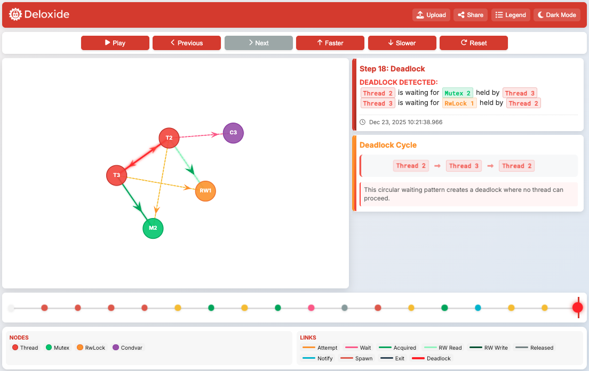

<p align="center">
  
</p>

<h1 align="center">Deloxide</h1>

<p align="center">
  Blazingly fast runtime deadlock detection for Rust.<br>
  Turn an unexplained hang into a concrete thread-and-lock cycle.
</p>

<p align="center">
  <a href="https://crates.io/crates/deloxide"></a>
  <a href="https://docs.rs/deloxide"></a>
  <a href="https://github.com/Emivvvvv/deloxide/actions/workflows/ci.yml"></a>
  <a href="https://crates.io/crates/deloxide"></a>
  <a href="LICENSE-MIT"></a>
</p>

<p align="center">
  <strong><a href="https://emivvvvv.github.io/deloxide/">User manual</a></strong>
  · <a href="https://docs.rs/deloxide">Rust API</a>
  · <a href="examples/diagnose_deadlock.rs">Runnable example</a>
  · <a href="https://github.com/Emivvvvv/deloxide/issues">Issues</a>
</p>

---

## Deadlocks should leave evidence

A deadlock can keep a process alive while useful work has stopped. It is often
timing-sensitive: add a log line or attach a debugger and the failure disappears.

Deloxide instruments the synchronization boundary itself. Replace the locks on a
suspect path with tracked `Mutex`, `RwLock`, and `Condvar` wrappers. When threads
block in a cycle, Deloxide reports the participating threads and the lock each one
is waiting for.



## Why switch to Deloxide?

The Rust ecosystem's existing approaches make a difficult trade-off. Static
analysis can be noisy on complex paths. Passive monitors preserve performance but
do not force rare schedules and report only when polled. Synchronous graph
debuggers detect immediately but can make every lock operation expensive.

Deloxide bridges that gap: synchronous active detection with an Optimistic Fast
Path, plus lock-order analysis, stress testing, structured callbacks, and
interactive visualization in one toolkit.

| Feature | STD | PL+DD | ND | **DX** |
| :--- | :---: | :---: | :---: | :---: |
| **Mutex overhead** | 0.88× | 1.00× | 1063.33× | **1.09×** |
| **Raytracing at 1080p** | 0.94× | 1.00× | 17.96× | **0.91× (faster)** |
| **Detection method** | None | Async (poll) | Synchronous | **Synchronous (instant)** |
| **Lock-order analysis** | No | No | No | **Yes** |
| **Stress testing** | No | No | No | **Yes** |
| **Visualization** | No | No | Text dump | **Interactive URL** |
| **False-positive rate in evaluated WFG controls** | N/A | Zero | Zero | **Zero** |

*STD = `std::sync`, PL+DD = `parking_lot` with `deadlock_detection`, ND =
`no_deadlocks`, DX = Deloxide. Results are from the historical full evaluation.*

The full suite has not yet been rerun for 1.1, but focused microbenchmarks remain
in the same nanosecond range and show no material default fast-path regression.
Read the detailed methodology and tables in the
[performance chapter](https://emivvvvv.github.io/deloxide/production/performance.html)
and the
[Deloxide preprint](https://papers.ssrn.com/sol3/papers.cfm?abstract_id=6389109).

## From hang to answer

```toml
[dependencies]
deloxide = "1.1"
```

Initialize once before the tracked workload:

```rust
use deloxide::{DeadlockSource, Deloxide};

Deloxide::new()
    .callback(|report| match report.source {
        DeadlockSource::WaitForGraph => {
            eprintln!("active cycle: {:?}", report.thread_cycle);
            eprintln!("waited locks: {:?}", report.thread_waiting_for_locks);
        }
        DeadlockSource::LockOrderViolation => {
            eprintln!("potential lock order: {:?}", report.lock_order_cycle);
        }
    })
    .start()
    .expect("start Deloxide");
```

Then use Deloxide locks where the competing paths meet. An opposite-order cycle
produces evidence like:

```text
source: WaitForGraph
thread_cycle: [ThreadId(2), ThreadId(3)]
thread_waiting_for_locks: [(ThreadId(2), LockId(7)), (ThreadId(3), LockId(4))]
```

Run the complete example:

```console
cargo run --example diagnose_deadlock
```

## Focused 1.1 check

The current Apple M1 Pro checkpoint measured an uncontended Deloxide Mutex at
**9.12 ns** median and the same-harness `parking_lot` Mutex at **10.28 ns**. This
focused check supports the no-regression statement; the full comparative suite,
raytracing results, manifestation tables, and reproduction notes live in
[Performance and benchmarks](https://emivvvvv.github.io/deloxide/production/performance.html).

## Pick the tool you need

| Mode | Enable | Use it for |
| --- | --- | --- |
| Active wait-for detection | Default | Report a current validated cycle |
| Logging and visualization | `logging-and-visualization` | Reconstruct the tracked event timeline |
| Lock-order analysis | `lock-order-graph` | Find potential acquisition-order risks |
| Random stress | `stress-test` + `with_random_stress()` | Broad schedule perturbation |
| Component stress | `stress-test` + `with_component_stress()` | Targeted reproduction delays |

`WaitForGraph` is active evidence. `LockOrderViolation` is a potential historical
risk; it does not mean threads are blocked now.

## Boundaries

Deloxide sees synchronization performed through its wrappers. A dependency that
crosses raw locks, third-party primitives, channels, I/O, another process, or a
remote service can remain outside the graph.

Optional logging adds queueing and file I/O. Stress modes intentionally change
timing. Benchmark the feature set you plan to ship and keep callbacks short.

## Rust first, C supported

Rust is the primary interface. Deloxide also builds a C library using
[`include/deloxide.h`](include/deloxide.h), with tracked mutexes, RwLocks,
condition variables, callbacks, and thread registration.

- [User manual](https://emivvvvv.github.io/deloxide/)
- [Rust API](https://docs.rs/deloxide)
- [Examples](examples)
- [C guide](https://emivvvvv.github.io/deloxide/c-guide.html)
- [Choosing Deloxide or another tool](https://emivvvvv.github.io/deloxide/comparison.html)
- [Contributing](CONTRIBUTING.md)
- [Security](SECURITY.md)
- [Changelog](CHANGELOG.md)

## License

Deloxide is available under the [MIT License](LICENSE-MIT) or
[Apache License 2.0](LICENSE-APACHE).
