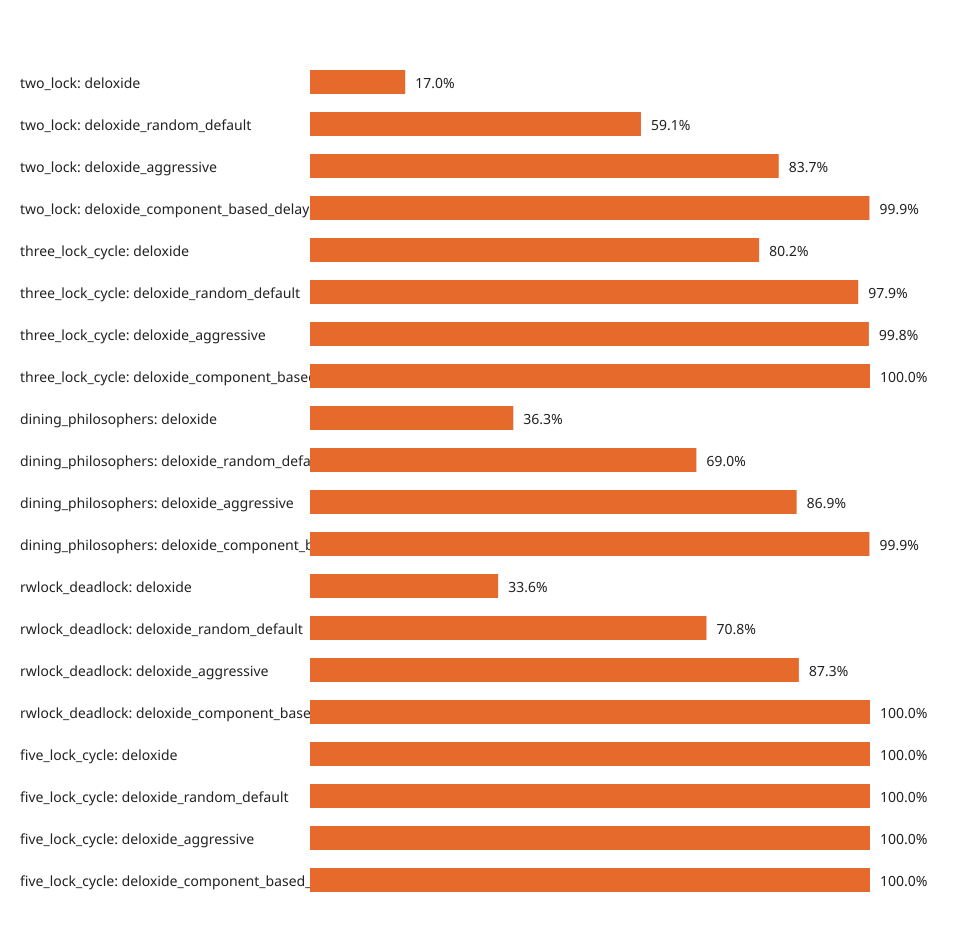

# Reproducing Timing-Sensitive Deadlocks

The `stress-test` Cargo feature adds controlled scheduling disturbance around tracked lock operations. It is a test tool, not a production default: delays and yields change latency, throughput, and timing, and a run that does not manifest a bug is not a proof of safety. Deloxide's normal default build has no optional stress feature enabled.

```toml
[dependencies]
deloxide = { version = "1.1.0", features = ["stress-test"] }
```

## Choose a stress mode

Random mode samples a delay before a lock acquisition when the thread already holds a tracked lock:

```rust,no_run
# extern crate deloxide;
use deloxide::Deloxide;

Deloxide::new()
    .with_random_stress()
    .start()
    .expect("detector initialization");
```

Component mode learns held-lock/acquisition relationships and preferentially delays paths in the same component or reverse order:

```rust,no_run
# extern crate deloxide;
use deloxide::Deloxide;

Deloxide::new()
    .with_component_stress()
    .start()
    .expect("detector initialization");
```

Both [`with_random_stress`](https://docs.rs/deloxide/1.1.0/deloxide/struct.Deloxide.html#method.with_random_stress) and [`with_component_stress`](https://docs.rs/deloxide/1.1.0/deloxide/struct.Deloxide.html#method.with_component_stress) select the default [`StressConfig`](https://docs.rs/deloxide/1.1.0/deloxide/struct.StressConfig.html) if no configuration has been supplied. Set the mode as well as the configuration: [`with_stress_config`](https://docs.rs/deloxide/1.1.0/deloxide/struct.Deloxide.html#method.with_stress_config) alone supplies parameters but does not enable a stress mode.

## Configure the disturbance

```rust,no_run
# extern crate deloxide;
use deloxide::{Deloxide, StressConfig};

Deloxide::new()
    .with_random_stress()
    .with_stress_config(StressConfig {
        preemption_probability: 0.7,
        min_delay_us: 200,
        max_delay_us: 1_500,
        preempt_after_release: true,
    })
    .start()
    .expect("detector initialization");
```

[`preemption_probability`](https://docs.rs/deloxide/1.1.0/deloxide/struct.StressConfig.html#structfield.preemption_probability) is the chance (0.0 through 1.0) that random mode chooses a pre-acquisition delay. [`min_delay_us`](https://docs.rs/deloxide/1.1.0/deloxide/struct.StressConfig.html#structfield.min_delay_us) and [`max_delay_us`](https://docs.rs/deloxide/1.1.0/deloxide/struct.StressConfig.html#structfield.max_delay_us) bound that sampled delay in microseconds. [`preempt_after_release`](https://docs.rs/deloxide/1.1.0/deloxide/struct.StressConfig.html#structfield.preempt_after_release) yields after tracked lock release; it is a scheduler yield, not an additional timed sleep.

Start low to keep ordinary tests quick, then increase only a focused reproduction:

```rust,no_run
# extern crate deloxide;
use deloxide::{Deloxide, StressConfig};

let gentle = Deloxide::new()
    .with_random_stress()
    .with_stress_config(StressConfig::gentle());

let aggressive = Deloxide::new()
    .with_component_stress()
    .with_stress_config(StressConfig::aggressive());

let _ = (gentle, aggressive); // call start() in the isolated test process
```

[`StressConfig::gentle`](https://docs.rs/deloxide/1.1.0/deloxide/struct.StressConfig.html#method.gentle) uses lower probability and shorter delays; [`StressConfig::aggressive`](https://docs.rs/deloxide/1.1.0/deloxide/struct.StressConfig.html#method.aggressive) increases both. Keep `min_delay_us <= max_delay_us` and record the exact four fields beside each failure.

## A reliable reproduction loop

1. Make the competing threads reach the intended acquisition point with a barrier or channels. Do not use a sleep to create the bug; use a sleep only inside the configured stress disturbance.
2. Run the scenario in a separate test process (or otherwise disposable process). Deloxide initialization is process-wide, and an intentional deadlock must not strand the main test runner.
3. Give the parent a hard timeout. On timeout, collect thread stacks, the callback payload, and the event log before terminating the child.
4. Have the parent classify every launched attempt before calculating a **manifestation rate**. Count an active `WaitForGraph` callback received before the deadline as a detection. Count a child that exits without that callback, and a timeout with no such callback, as no active detection. The rate is `active detections / all attempts classified as detection or no detection`; exclude only harness infrastructure failures, and report those failures separately with the launched-attempt count. A potential `LockOrderViolation` callback is not an active detection.
5. Save the test-case seed, scheduler/input seed, attempt number, platform, feature set, and complete `StressConfig`. Deloxide currently draws stress randomness from its runtime RNG and exposes no seed-setting API, so record and control the surrounding harness seed when replayability matters.

The revalidated results chart is useful for comparing configurations, but it is not a promise that a particular machine or run will find the same defect:



Use it to choose a budget for reproduction, then validate a fix with deterministic synchronization and normal tests. Stress may turn a potential [`LockOrderViolation`](lock-order.md) into an active `WaitForGraph` report, but failure to do so only means the tested schedules did not manifest the cycle.
