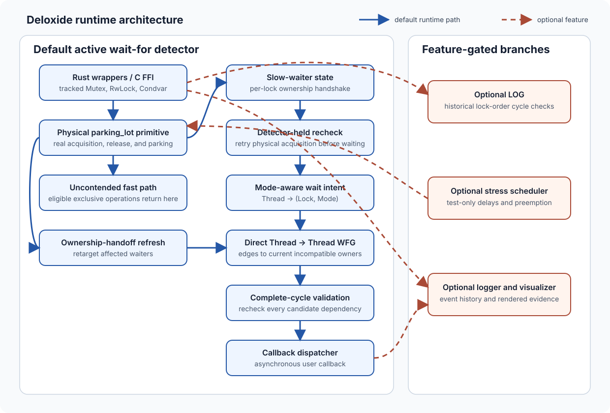

# Architecture and Fast Path

Deloxide wraps real `parking_lot` synchronization primitives. The wrapper decides
whether an operation can finish locally or must synchronize detector state; the
global detector does not replace the physical lock and does not protect your
application data.

Solid arrows are work in the default active wait-for detector. Dashed arrows are
compile-time features: the lock-order graph (LOG), stress scheduling, and logging
with visualization. Neither historical order analysis nor event logging exists in
a default-feature build.

## Where state lives

| Boundary | Current responsibility | Source |
| --- | --- | --- |
| Rust wrappers and C entry points | Reach the tracked `Mutex`, `RwLock`, and `Condvar` wrappers and their physical `parking_lot` objects. | `src/core/locks/` |
| Per-lock metadata | Publish a Mutex owner or RwLock writer hint and count blocking slow-path activity. | `src/core/locks/mutex.rs`, `rwlock.rs`, and `contention.rs` |
| Global detector | Serialize ownership maps, counted readers, mode-aware wait intents, reverse waiter lookup, and graph repair behind one detector mutex. | `src/core/detector/mod.rs` and `wait.rs` |
| Direct wait-for graph | Store `Thread -> Thread` adjacency and search for a path that a new dependency would close into a cycle. | `src/core/graph/wait_for_graph.rs` |
| Report boundary | Validate active evidence, then send `DeadlockInfo` to a dedicated callback thread outside the detector lock. | `src/core/detector/deadlock_handling.rs` and `mod.rs` |

The per-lock owner value is a hint for bridging an exclusive fast acquisition into
the global detector when contention appears. The detector's mode-aware ownership
maps are the facts used to resolve and validate dependencies. See
[Wait-For Graph](wait-for-graph.md) for that separation.

## Eligible uncontended exclusive operations

Blocking Mutex acquisition and RwLock write acquisition begin with a physical
`try_lock`/`try_write` when the `stress-test` feature is not compiled:

1. The wrapper attempts the physical primitive before entering the global
   detector.
2. On success, it publishes the actual thread ID to the per-lock owner atomic.
3. It checks the per-lock slow-waiter count. If there is no slow waiter and the
   `lock-order-graph` feature is not compiled, it can return without ownership-map
   updates, wait-intent allocation, graph traversal, or the detector mutex.
4. On guard drop, it clears the owner hint before the physical guard is released.
   A guard that was globally tracked, or a release that observes a slow waiter, also
   reports the release and repairs affected detector state. Otherwise release
   stays local.

Successful nonblocking `try_lock` and `try_write` use the same publication rule.
Logging, when compiled and initialized, can record an eligible fast operation
without turning it into wait-for graph work.

RwLock reads deliberately use a different path. Even an uncontended read calls
the detector while attempting the physical read because the detector must count
every live reader by thread. A future writer depends on all of those reader
identities. “Uncontended fast path” therefore means detector-bypassing Mutex and
RwLock write operations, not every tracked operation.

## The contention handshake

When an initial physical attempt fails, the wrapper registers a per-lock
`SlowWaiter` token before acquiring the global detector mutex. While holding that
mutex, it tries the physical acquisition again:

- If the recheck succeeds, acquisition is completed in detector state and no wait
  intent is persisted.
- If it still fails, the wrapper reads the actual Mutex owner or RwLock writer hint,
  records `Thread -> (Lock, Mode)`, derives direct edges to incompatible owners,
  and returns any candidate cycle for validation.
- The wrapper then leaves the detector, blocks in `parking_lot`, publishes the
  actual owner after physical acquisition, completes the detector acquisition,
  and finally drops the slow-waiter token.

The token makes concurrent fast-path owners publish globally while a waiter could
depend on them. Condvar wait uses the same protection: it holds a Mutex contention
token across physical release, sleep, and possible reacquisition, so a fast owner
during that interval publishes the owner that really acquired the mutex.
Notification never substitutes the notifier as an owner.

This handshake narrows the interval between failed physical acquisition and
dependency registration. It is not a claim that the owner atomic and slow-waiter
atomic form one linearizable snapshot; they are separate atomic values. The
current implementation relies on the detector-held physical recheck, ownership
publication, and affected-waiter repair. Packing owner and contention into one
state word remains deferred.

## Ownership publication and repair

Completing a contended Mutex or RwLock write updates detector ownership, clears the
acquiring thread's intent, and refreshes waiters affected by that lock. Mutex
release performs a full affected-waiter refresh after removing its owner. RwLock
transitions are mode-specific: successful detector-mediated reads add or increment
the reader count, successful nonblocking reads refresh existing lock waiters, and
final reader or writer release removes the corresponding stale owner edges.

Refresh uses the stable wait intent rather than trusting an older sampled target.
If lock L transfers from T1 to T3 while T2 is still waiting, the derived edge can
change from `T2 -> T1` to `T2 -> T3`. Maintenance continues across all owners and
all indexed waiters even after it retains the first candidate cycle. Current
source does not call one universal “refresh everything” operation on every RwLock
transition, so the guarantee should be understood through these concrete paths,
not as an idealized atomic graph snapshot.

## Optional work is genuinely optional

- `lock-order-graph` can maintain historical `Lock -> Lock` acquisition order.
  Compiling it makes eligible exclusive acquisitions detector-visible; the graph
  itself is present only when runtime configuration enables checking. Its findings
  are potential order cycles, not active wait cycles.
- `stress-test` removes the normal early-return branch for blocking Mutex and
  RwLock writes. Configured stress modes can also delay a slow attempt and yield
  after release to perturb scheduling.
- `logging-and-visualization` adds an event logger and the evidence consumed by the
  visualizer. Without the feature, logger hooks are no-ops. With it, logging is a
  separate evidence path and does not make the LOG active.

The callback dispatcher is part of the active detector, not a logging feature.
Validated evidence is queued after the detector mutex is released; a panic from
one callback invocation is contained so the dispatcher can process later reports.

## Cost model, without universal promises

An eligible uncontended Mutex or RwLock write performs a physical try operation,
owner publication, and contention observations: expected constant local work.
RwLock reads also serialize briefly on the detector and update hash maps. Physical
parking and scheduler behavior remain costs of `parking_lot` and the operating
system, not costs this model bounds.

Let `V` and `E` describe the explored direct thread graph. A single breadth-first
path search is `O(V + E)` in the explored component. A wait or refresh can propose
multiple owner edges, and a lock can have multiple indexed waiters, so its total
work also depends on the incompatible-owner and waiter counts; it is not
universally “one linear scan.” Complete validation depends on cycle length and
mode-aware owner lookup, including enumerating RwLock readers for write waits.

Memory grows with tracked owners and reader recursion counts, current wait intents,
the lock-to-waiter index, forward and reverse WFG edges, and cached traversal
buffers. Optional LOG state and logging queues add separate growth. These are
shape-dependent bounds, not a fixed per-process cap.
