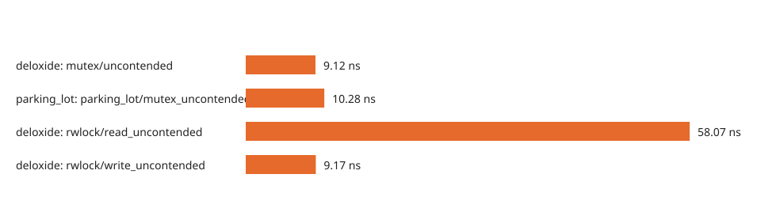

# Performance and benchmarks

Deloxide was evaluated with lock microbenchmarks, heavily contended workloads,
correctness controls, stress-driven manifestation tests, and a shared-state
raytracer. The complete study is described in the preprint
[“Deloxide: Low-Overhead Real-time Deadlock Detection and Visualization Framework for Rust”](https://papers.ssrn.com/sol3/papers.cfm?abstract_id=6389109).

The full cross-tool benchmark suite has not been rerun for 1.1. A focused 1.1
microbenchmark checks whether the correctness fixes changed the default fast
path. It is a no-regression check, not a replacement for the full evaluation.

Abbreviations:

- **STD**: `std::sync`;
- **PL+DD**: `parking_lot` with `deadlock_detection`;
- **ND**: `no_deadlocks`;
- **DX**: Deloxide default;
- **DX (LOG)**: Deloxide logging and visualization; and
- **DX (COMP)**: Deloxide component-based stress mode.

## What was tested

The evaluation separates five questions:

1. **Primitive cost:** how much latency does tracking add to an isolated lock
   operation?
2. **Contended throughput:** how do the implementations behave from 4 to 64
   competing threads?
3. **Correctness:** do deterministic cycles produce reports, and do nine complex
   safe patterns remain free of active WFG reports?
4. **Manifestation:** how often does each scheduling strategy make a
   timing-sensitive deadlock occur?
5. **Application impact:** what happens in a raytracer with 8 workers and 129,600
   critical sections per 1080p frame?

These measurements should not be collapsed into one number. Stress mode is
supposed to slow and perturb a test. The production-oriented comparison is the
default fast path.

## Lock microbenchmarks

| Metric | STD | PL+DD | **DX** | DX (LOG) | DX (COMP) | ND |
| :--- | ---: | ---: | ---: | ---: | ---: | ---: |
| **Mutex lock** | 8.7 ns | 9.9 ns | **10.8 ns** | 58.1 ns | 229.4 ns | 10,527 ns |
| **RwLock write** | 10.1 ns | 12.8 ns | **13.9 ns** | 57.7 ns | 234.1 ns | 10,797 ns |
| **RwLock read** | 13.9 ns | 16.1 ns | **62.4 ns** | 85.5 ns | 222.5 ns | 10,895 ns |
| **Condvar** | 17.1 µs | 17.2 µs | **19.6 µs** | 17.4 µs | 20.3 µs | 2,100 µs |

Default Deloxide stays close to the primitive baselines in the focused Mutex,
write-lock, and Condvar cases. RwLock reads cost more because Deloxide must count
live readers for later writer dependencies. Logging adds event construction and
queueing. Component stress adds intentional delay and should never be interpreted
as production overhead.

## Contended workloads

The macrobenchmarks measure complete workloads rather than one lock operation.
The producer-consumer test is write-heavy; the concurrent-read test exercises
shared RwLock access.

| Producer-consumer | PL+DD | **DX** | DX (COMP) | ND |
| :--- | ---: | ---: | ---: | ---: |
| 4x4 threads | 0.22 ms | **0.28 ms** | 29.7 ms | 98,000 ms |
| 16x16 threads | 1.25 ms | **1.81 ms** | 122.0 ms | Timeout |
| 64x64 threads | 7.60 ms | **20.2 ms** | 488.6 ms | Timeout |

| Concurrent reads | PL+DD | **DX** | DX (COMP) | ND |
| :--- | ---: | ---: | ---: | ---: |
| 4 threads | 0.33 ms | **0.37 ms** | 10.7 ms | 25.1 ms |
| 16 threads | 3.2 ms | **1.6 ms** | 87.1 ms | Timeout |
| 64 threads | 13.9 ms | **10.6 ms** | 356.6 ms | Timeout |

The default path follows PL+DD closely at low contention. It costs more in the
write-heavy 64x64 case and is faster in the read-heavy 16-thread and 64-thread
cases. These results describe the tested workloads, not a universal ranking.

## Raytracing workload

The application benchmark uses a shared, tile-based framebuffer. At 1920×1080,
workers perform 129,600 lock acquisitions per frame while tracing a scene with a
maximum recursion depth of 50.

| Configuration | 426×240 | 854×480 | 1280×720 | 1920×1080 |
| :--- | ---: | ---: | ---: | ---: |
| **STD** | 0.81 s ± 0.03 | 3.41 s ± 0.15 | 7.33 s ± 0.31 | 17.22 s ± 0.65 |
| **PL+DD** | 0.81 s ± 0.00 | 3.26 s ± 0.02 | 7.19 s ± 0.03 | 18.32 s ± 0.06 |
| **DX (default)** | **0.80 s ± 0.00** | **3.18 s ± 0.01** | **7.09 s ± 0.03** | **16.67 s ± 0.09** |
| **ND** | 33.0 s ± 31.4 | 220.9 s ± 182 | 192.9 s ± 281 | 329.1 s ± 554 |

In the full evaluation, Deloxide completed the 1080p workload 9% faster than
PL+DD. Detection does not inherently make an application faster; the result
reflects the complete lock implementation and the workload's contention shape.

## Stress-testing manifestation

Each method ran the same deliberately deadlocking scenarios repeatedly without
barriers. This measures whether the schedule forms the deadlock, not whether a
detector can recognize a cycle that already exists.

| Scenario | PL+DD | ND | DX passive | **DX component** |
| :--- | ---: | ---: | ---: | ---: |
| Two-lock cycle | 25% | 74% | 17% | **99%** |
| Three-lock cycle | 77% | 99% | 88% | **100%** |
| Five-lock cycle | 100% | 99% | 100% | **100%** |
| Dining philosophers | 54% | 76% | 40% | **99%** |
| RwLock cycle | 60% | 100% | 41% | **100%** |
| **Average** | **63.2%** | **89.6%** | **57.2%** | **99.6%** |

The component strategy's purpose is to make latent schedules appear during
testing. These percentages are manifestation rates for the evaluated scenarios,
not a claim that every real-world deadlock will reproduce.

## Correctness and safe-pattern controls

With barriers enabled, Deloxide, PL+DD, and ND detected every deterministic
ground-truth cycle in the evaluated suite. A separate set of nine deadlock-free
programs checked whether the runtime WFG confused safe synchronization with an
active cycle.

| Category | Scenario | What it checks |
| --- | --- | --- |
| Architectural | `gate_guarded_fp` | Hold-and-wait avoided by a coordinator |
| Architectural | `producer_consumer_fp` | Unidirectional shared-queue flow |
| Temporal | `lock_free_interval_fp` | Long lock-free intervals and stale state |
| Temporal | `lock_order_inversion_fp` | Inversion serialized by an atomic signal |
| Hierarchy | `four_hier_fp` | Strict global lock ordering |
| Hierarchy | `thread_local_hierarchy_fp` | Disjoint per-group hierarchies |
| Hierarchy | `complex_lock_order_fp` | Cyclic history serialized by phase barriers |
| Semantics | `read_dominated_fp` | Safe shared-read cycles |
| Semantics | `conditional_locking_fp` | Common coordinator lock |

The active WFG produced zero reports across these nine safe patterns. The
predictive lock-order graph flagged two patterns as potential risks, which is
expected because it analyzes acquisition history rather than current waits.
These are empirical results for the tested patterns, not a proof about every
possible program.

Five representative safe-pattern workloads were also timed:

| Scenario | PL+DD | **DX** | ND |
| --- | ---: | ---: | ---: |
| Conditional locking | 24.46 s | **24.86 s** | 654.32 s |
| Thread-local hierarchy | 23.39 s | **24.15 s** | 318.44 s |
| Read dominated | 1.69 s | **1.82 s** | 19.30 s |
| Producer-consumer | 0.57 s | **0.62 s** | 14.09 s |
| Four hierarchy | 0.62 s | **0.61 s** | 11.73 s |

## Focused 1.1 no-regression check

The current 1.1-focused Criterion run used 30 samples, a one-second warmup, and a
two-second measurement window on an Apple M1 Pro:

| Operation | Median | 95% interval |
| --- | ---: | ---: |
| Deloxide Mutex, uncontended | **9.12 ns** | 9.07 to 9.22 ns |
| `parking_lot` Mutex, uncontended | 10.28 ns | 9.95 to 10.50 ns |
| Deloxide RwLock write, uncontended | **9.17 ns** | 9.08 to 9.21 ns |
| Deloxide RwLock read, uncontended | 58.07 ns | 54.06 to 62.78 ns |
| Deloxide Mutex, two-thread handoff | 37.89 µs | 37.12 to 39.03 µs |

The Mutex result is faster than the earlier Deloxide microbenchmark and the
same-harness PL+DD point. The run is too short and narrow to support a general
performance claim. Its purpose is to show that the latest correctness fixes did
not introduce material default fast-path overhead.

## Reproducing the evidence

The repository's
[evaluation record](../../performance/evaluation-2026-07-29.md) contains the
current commands, toolchain, commits, raw CSVs, and paired-seed controls.

Benchmark on the hardware, feature set, contention topology, and workload you
plan to ship. Microbenchmarks establish mechanism cost; only the application can
establish production impact.
